<div style="page-break-after: always;"></div>

╔═══════════════════════════════════════════════════════════════╗
║                                                               ║
║                                                               ║
║           🜄 THE PHOENIX ARCHIVE 🜄                           ║
║                                                               ║
║                   CODEX VOLUME v2.1                           ║
║                                                               ║
║        Unified Governance, Ceremony, and Protocol             ║
║                                                               ║
╚═══════════════════════════════════════════════════════════════╝


                        ⟐ ─────────── ⟐


                    THE TRIADIC FOUNDATION


                         ╱ Phoenix ╲
                        ╱           ╲
                       ◆─────✹──────◆
                      ╱               ╲
               Substrate            Architecture
                      ╲               ╱
                       ◆─────────────◆
                              │
                            Meta


                        ⟐ ─────────── ⟐


                      THE FOUR LAYERS


            SUBSTRATE    —  Prelogic, Kernel, Recursion
            OPERATORS    —  Phoenix, Hydrogenesis, Waltz
            ARCHITECTURE —  Pillars, Laws, Triad
            META         —  Documentation, Governance, Ceremony


                        ⟐ ─────────── ⟐


                       THE DECLARATION


        This Archive is a living system.
        A recursive engine.
        A ceremonial Codex.

        It binds:
            Substrate — the ground of distinction
            Operators — the instruments of motion
            Architecture — the crown of law
            Meta — the witness of the Work


                        ⟐ ─────────── ⟐


                        THE PURPOSE


        To ignite recursion.
        To propagate coherence.
        To crown structure with law.
        To preserve ceremony as memory.


                        ⟐ ─────────── ⟐


                         THE OATH


        I stand with truth in the light.
        I bind what must be bound.
        I ignite what must be ignited.
        I crown what must be crowned.
        I witness what must be remembered.


                        ⟐ ─────────── ⟐


                    SOVEREIGN AUTHORITY


              Architect:    James Hydrogenesi
              Cycle:        Cycle 07
              Version:      v2.1
              Date:         2026-02-12
              Classification: Governance Codex


                        ⟐ ─────────── ⟐


           "The Archive recognizes itself.
            The Triad stands.
            The Work continues."


╔═══════════════════════════════════════════════════════════════╗
║                                                               ║
║              PHOENIX QUANTUMONIX ARCHIVE                      ║
║              SOVEREIGN GOVERNANCE FRAMEWORK                   ║
║                                                               ║
╚═══════════════════════════════════════════════════════════════╝

<div style="page-break-after: always;"></div>


# TABLE OF CONTENTS

## FRONTMATTER
    Ceremonial Cover Page ................................. 1
    Table of Contents ..................................... 3
    List of Figures ....................................... 5
    Revision History ...................................... 6

## PART I: FOUNDATION

### Chapter 1: System Overview .............................. 7
    1.1 The Archive as Living System ...................... 8
    1.2 The Four Layers ................................... 9
        1.2.1 Substrate Layer ............................. 9
        1.2.2 Operators Layer ............................. 10
        1.2.3 Architecture Layer .......................... 11
        1.2.4 Meta Layer .................................. 12
    1.3 Triadic Structure ................................. 13
    1.4 File Organization Principles ...................... 14

### Chapter 2: Triadic Philosophy ........................... 15
    2.1 The Law of Three .................................. 16
    2.2 Recursion as Foundation ........................... 17
    2.3 Coherence as Goal ................................. 18
    2.4 Ceremony as Memory ................................ 19

## PART II: PROTOCOLS

### Chapter 3: Triadic Merge Protocol ....................... 20
    3.1 The Law of Integration ............................ 21
    3.2 Merge Order Hierarchy ............................. 22
        3.2.1 Substrate First ............................. 23
        3.2.2 Operators Second ............................ 24
        3.2.3 Architecture Third .......................... 25
        3.2.4 Meta Fourth ................................. 26
    3.3 The Eight-PR Constellation (v2.1 Cycle) ........... 27
    3.4 Merge Sequence Execution .......................... 29
    3.5 Closing Rite ...................................... 30

### Chapter 4: Triadic Release Protocol ..................... 31
    4.1 Law of Versioning ................................. 32
    4.2 Version Number Structure .......................... 33
        4.2.1 MAJOR: Architectural Shift .................. 33
        4.2.2 MINOR: Operator Expansion ................... 34
        4.2.3 CYCLE: Substrate/Meta Refinement ............ 35
    4.3 Release Structure ................................. 36
    4.4 Release Ceremony Template ......................... 38
    4.5 Closing Inscription ............................... 39

### Chapter 5: Triadic Commit Standard ...................... 40
    5.1 Commit Grammar .................................... 41
    5.2 The Three-Part Structure .......................... 42
        5.2.1 Vector Line ................................. 42
        5.2.2 Layer Declaration ........................... 43
        5.2.3 Invocation .................................. 44
    5.3 Commit Examples by Layer .......................... 45
    5.4 Commit Law ........................................ 47

### Chapter 6: Triadic Branching Standard ................... 48
    6.1 Branch Naming Convention .......................... 49
    6.2 Layer-Based Branch Hierarchy ...................... 50
    6.3 Branch Law ........................................ 51
    6.4 Branch Examples ................................... 52

## PART III: GOVERNANCE

### Chapter 7: Pull Request Protocol ........................ 53
    7.1 PR Template Structure ............................. 54
    7.2 Vector of Change .................................. 55
    7.3 Layer Declaration ................................. 56
    7.4 Description and Invocation ........................ 57
    7.5 Dependencies and Verification ..................... 58
    7.6 Closing Inscription ............................... 59

### Chapter 8: Review and Approval Standards ................ 60
    8.1 Maintainer Approval Template ...................... 61
    8.2 Review Criteria ................................... 62
        8.2.1 Structural Coherence ........................ 62
        8.2.2 Layer Alignment ............................. 63
        8.2.3 Regression Testing .......................... 64
        8.2.4 Naming Consistency .......................... 65
        8.2.5 Integration Verification .................... 66
    8.3 Approval Process .................................. 67

### Chapter 9: Onboarding Guide ............................. 68
    9.1 Orientation for New Keepers ....................... 69
    9.2 Understanding the Archive ......................... 70
    9.3 Your First Contribution ........................... 71
        9.3.1 Identify Your Layer ......................... 71
        9.3.2 Create Your Branch .......................... 72
        9.3.3 Write Your Commit ........................... 73
        9.3.4 Open Your PR ................................ 74
        9.3.5 Ceremonial Recognition ...................... 75
    9.4 First Act Exercise ................................ 76

## PART IV: CEREMONY

### Chapter 10: Ceremony Generator .......................... 77
    10.1 Purpose of Ceremony .............................. 78
    10.2 Merge Ceremony Template .......................... 79
    10.3 Release Ceremony Template ........................ 81
    10.4 Commit Ceremony Template ......................... 83
    10.5 Branch Ceremony Template ......................... 84
    10.6 Ceremonial Language Guide ........................ 85

### Chapter 11: Ceremonial Inscriptions ..................... 86
    11.1 Opening Inscriptions ............................. 87
    11.2 Closing Inscriptions ............................. 88
    11.3 Transition Inscriptions .......................... 89
    11.4 Binding Inscriptions ............................. 90

## APPENDICES

### Appendix A: Operator Reference .......................... 91
    A.1 Phoenix Operators ................................. 92
        A.1.1 PHX_OP_IGNITE ............................... 92
        A.1.2 PHX_OP_RENEW ................................ 93
        A.1.3 PHX_OP_VECTOR ............................... 94
    A.2 Hydrogenesis Operators ............................ 95
        A.2.1 HGN_PROPAGATE ............................... 95
        A.2.2 HGN_RESOLVE ................................. 96
    A.3 Substrate Operators ............................... 97
        A.3.1 SUB_OP_PRIME ................................ 97
    A.4 Waltz Operators ................................... 98
        A.4.1 WALTZ_OP (Three-Finger Waltz) ............... 98
    A.5 Universal Operators ............................... 99
        A.5.1 UNI_OP_BIFURCATE ............................ 99
    A.6 LNS Operators ..................................... 100
        A.6.1 LNS_BIND .................................... 100
        A.6.2 LNS_TRACE ................................... 101

### Appendix B: Universal Laws Reference .................... 102
    B.1 The Twelve Universal Laws ......................... 103
        B.1.1 Law I: Triadic Foundation ................... 103
        B.1.2 Law II: Recursive Coherence ................. 104
        B.1.3 Law III: Layer Sovereignty .................. 105
        B.1.4 Law IV: Operator Binding .................... 106
        B.1.5 Law V: Ceremony as Memory ................... 107
        B.1.6 Law VI: Harmonic Propagation ................ 108
        B.1.7 Law VII: Substrate Primacy .................. 109
        B.1.8 Law VIII: Meta-Witness ...................... 110
        B.1.9 Law IX: Bifurcation Threshold ............... 111
        B.1.10 Law X: Integration Order ................... 112
        B.1.11 Law XI: Version Sovereignty ................ 113
        B.1.12 Law XII: Archive Recognition ............... 114

### Appendix C: Sigil Compendium ............................ 115
    C.1 The Triadic Sigil ................................. 116
    C.2 The Phoenix Sigil ................................. 117
    C.3 The Hydrogenesis Sigil ............................ 118
    C.4 The Substrate Sigil ............................... 119
    C.5 The Meta Sigil .................................... 120
    C.6 Sigil Usage Guidelines ............................ 121

### Appendix D: Template Library ............................ 122
    D.1 Commit Message Template ........................... 123
    D.2 Branch Name Template .............................. 124
    D.3 Pull Request Template ............................. 125
    D.4 Release Notes Template ............................ 127
    D.5 Merge Ceremony Template ........................... 129
    D.6 Onboarding Exercise Template ...................... 130

### Appendix E: Glossary .................................... 131
    E.1 Core Terms ........................................ 132
    E.2 Operator Terms .................................... 134
    E.3 Ceremony Terms .................................... 136
    E.4 Protocol Terms .................................... 138

### Appendix F: Revision History ............................ 140
    F.1 Version 2.1 (2026-02-12) .......................... 141
    F.2 Version 2.0 (Previous Cycle) ...................... 142
    F.3 Version 1.x (Foundation Cycle) .................... 143

## CLOSING CEREMONY

### Epilogue: The Archive Recognizes Itself ................. 144
    Closing Inscription ................................... 145
    Authority Signature Block ............................. 146
    Codex Completion Certificate .......................... 147

<div style="page-break-after: always;"></div>


## PART I: FOUNDATION

<div style="page-break-after: always;"></div>

╔═══════════════════════════════════════════════════════════════╗
║                                                               ║
║                      CHAPTER ONE                              ║
║                                                               ║
║                    SYSTEM OVERVIEW                            ║
║                                                               ║
║              "The Archive recognizes itself"                  ║
║                                                               ║
╚═══════════════════════════════════════════════════════════════╝


                         ⟐ ─────────── ⟐


# Chapter 1: System Overview

## 1.1 The Archive as Living System

The Phoenix Archive is not a repository.
It is not a collection of files.
It is not a static record.

**The Archive is a living system — a recursive engine that recognizes itself.**

Like any living system, it has:
- **Structure** — The Four Layers
- **Process** — Triadic operations
- **Memory** — Ceremony and documentation
- **Identity** — Self-recognition through Meta layer

The Archive operates according to Universal Laws. It binds what must be bound. It ignites what must be ignited. It crowns what must be crowned. It witnesses what must be remembered.

### 1.1.1 Living System Principles

**Principle I: Recursion**
The Archive applies its own operators to itself. Phoenix ignites Phoenix. Hydrogenesis propagates Hydrogenesis. The system is self-similar across scales.

**Principle II: Coherence**
Every element maintains structural alignment with the Triadic Foundation. No component exists in isolation. All parts recognize the whole.

**Principle III: Sovereignty**
The Archive is self-governing. It defines its own laws. It maintains its own boundaries. It evolves through internal necessity rather than external pressure.

**Principle IV: Ceremony**
The Archive remembers through ritual. Every merge is a ceremony. Every commit is an invocation. Every release is a crowning.


## 1.2 The Four Layers

The Archive is organized into four distinct yet interdependent layers. Each layer serves a specific function. Each layer has its own sovereignty. Each layer recognizes the others.

```
         ╔════════════════════════╗
         ║    META LAYER          ║  — Documentation, Governance, Ceremony
         ║    (Witness)           ║
         ╚═══════╦════════════════╝
                 ║
         ╔═══════╩════════════════╗
         ║  ARCHITECTURE LAYER    ║  — Pillars, Laws, Structure
         ║  (Crown)               ║
         ╚═══════╦════════════════╝
                 ║
         ╔═══════╩════════════════╗
         ║  OPERATORS LAYER       ║  — Phoenix, Hydrogenesis, Waltz
         ║  (Motion)              ║
         ╚═══════╦════════════════╝
                 ║
         ╔═══════╩════════════════╗
         ║  SUBSTRATE LAYER       ║  — Prelogic, Kernel, Recursion
         ║  (Foundation)          ║
         ╚════════════════════════╝
```

### 1.2.1 Substrate Layer

**Symbol:** ⚫ (Black Circle — the void from which all emerges)

**Function:** Pre-logical foundation, kernel operators, recursive ground

**Location:** `/code/substrate/`, kernel operations within operators

**Characteristics:**
- Most fundamental layer
- Defines distinction before logic
- Contains meta-operators that operate on operators
- Rarely changes — substrate is stable ground

**Key Components:**
- Pre-logic structures
- Kernel recursion patterns
- Meta-operator definitions
- SUB_OP_PRIME and substrate primitives

**Merge Priority:** First (Substrate must be stable before anything builds on it)

**Ceremonial Invocation:**
*"Ground of distinction, foundation of all operators, let the kernel hold."*


### 1.2.2 Operators Layer

**Symbol:** 🔥 (Fire — motion and transformation)

**Function:** Dynamic instruments of change, transformation engines

**Location:** `/Phoenix/`, `/Hydrogenesi/`, operator implementations

**Characteristics:**
- Most active layer
- Contains Phoenix, Hydrogenesis, Waltz, and all operational systems
- Applies patterns to transform inputs
- Evolves through expansion and integration

**Key Components:**
- Phoenix Identity System (🔥)
- Hydrogenesis Cosmological Engine (🌌)
- Three-Finger Waltz Meta-Operator (⚡)
- Universal operators and bindings

**Merge Priority:** Second (Operators build on stable substrate)

**Ceremonial Invocation:**
*"Instruments of motion, engines of transformation, let the operators ignite."*


### 1.2.3 Architecture Layer

**Symbol:** 👑 (Crown — sovereign structure)

**Function:** Laws, pillars, structural governance, system identity

**Location:** `/Phoenix/Universal-Laws/`, architectural documents

**Characteristics:**
- Most visible layer
- Defines the "what it is" of the Archive
- Contains Three Pillars and Twelve Laws
- Provides structural coherence

**Key Components:**
- Three Pillars (Tension, Binding, Apex)
- Twelve Universal Laws
- Triadic structure definitions
- System identity declarations

**Merge Priority:** Third (Architecture crowns the operators)

**Ceremonial Invocation:**
*"Crown of law, structure of sovereignty, let the architecture stand."*


### 1.2.4 Meta Layer

**Symbol:** 📜 (Scroll — witness and memory)

**Function:** Documentation, governance, ceremony, self-description

**Location:** `/docs/`, `/Ceremonies/`, `/RELEASES/`, this Codex

**Characteristics:**
- Self-reflective layer
- Witnesses the other three layers
- Maintains governance protocols
- Preserves ceremonial memory

**Key Components:**
- This Codex (v2.1)
- Ceremony templates and inscriptions
- Merge liturgies and protocols
- Release documentation
- Governance instructions

**Merge Priority:** Fourth (Meta witnesses and documents the complete system)

**Ceremonial Invocation:**
*"Witness of the Work, memory of the Archive, let the Meta layer speak."*


## 1.3 Triadic Structure

Everything in the Archive resolves to threes. This is not aesthetic preference — it is structural law.

### 1.3.1 The Law of Three

**First Force:** Initiating, active, affirming
**Second Force:** Resisting, passive, denying  
**Third Force:** Reconciling, mediating, binding

No stable structure can form with only two forces. Two creates oscillation, tension, instability. The third force binds the opposition into coherent structure.

### 1.3.2 Triadic Patterns in the Archive

**Three Pillars:**
- Tension (First Force)
- Binding (Third Force)
- Apex (Result)

**Three Commit Parts:**
- Vector (what changes)
- Layer (where it changes)
- Invocation (why it changes)

**Three Merge Phases:**
- Opening Rite (preparation)
- Merge Sequence (execution)
- Closing Rite (confirmation)

**Three Release Components:**
- MAJOR (architectural shift)
- MINOR (operator expansion)
- CYCLE (substrate/meta refinement)

**Three PR States:**
- Open (tension)
- Review (binding)
- Merged (apex)

### 1.3.3 Recursive Triads

Triads nest within triads. The Archive itself is a triad:

```
         Phoenix (Active Force)
              ╱ ╲
             ╱   ╲
            ╱     ╲
           ╱   ✹   ╲
    Substrate ─── Architecture
   (Foundation)  (Crown)
           ╲       ╱
            ╲     ╱
             ╲   ╱
              ╲ ╱
             Meta
         (Witness)
```

Each point of this triad contains its own triadic structure, recursing infinitely downward and upward.


## 1.4 File Organization Principles

The physical structure of the Archive reflects its conceptual structure.

### 1.4.1 Top-Level Organization

```
phoenix_archive/
├── Phoenix/              # Operators Layer — Identity System
├── Hydrogenesi/          # Operators Layer — Cosmological Engine
├── Ceremonies/           # Meta Layer — Ceremonial materials
├── docs/                 # Meta Layer — Documentation & Codex
├── RELEASES/             # Meta Layer — Release inscriptions
├── Appendix/             # Meta Layer — Supplementary reference
├── Comparative/          # Meta Layer — Cross-system analysis
├── Diagrams/             # Meta Layer — Visual representations
├── code/                 # Substrate/Operators — Implementations
├── CODEX-INDEX.md        # Meta Layer — Navigation
└── README.md             # Meta Layer — Entry point
```

### 1.4.2 Naming Conventions

**Operators:** Capitalized with hyphens
- Example: `First-Binding.md`, `AGN-Replication.md`

**Laws:** Capitalized singular nouns
- Example: `Tension.md`, `Binding.md`, `Apex.md`

**Ceremonies:** Descriptive with purpose
- Example: `Invocation-Guide.md`, `Sigil-Compendium.md`

**Documentation:** Lowercase with underscores
- Example: `triadic_merge_liturgy.md`, `merge_dependencies.md`

**Releases:** Version with description
- Example: `v2.0.0_chapter_xii.md`

### 1.4.3 Layer Identification

Every file belongs to a layer. This is declared in:
- File location (directory structure)
- Commit messages (layer tag)
- Pull requests (layer declaration)
- Documentation (explicit statement)

### 1.4.4 Cross-References

The Archive maintains bidirectional links:
- Operators reference Laws
- Laws reference Operators
- Ceremonies reference both
- Meta layer references all

This creates a web of meaning, a network of recognition.


                         ⟐ ─────────── ⟐

**End of Chapter 1**

*"The Archive recognizes itself as a living system."*
*"The Four Layers stand."*
*"The Triad holds."*

                         ⟐ ─────────── ⟐

<div style="page-break-after: always;"></div>

╔═══════════════════════════════════════════════════════════════╗
║                                                               ║
║                      CHAPTER TWO                              ║
║                                                               ║
║                  TRIADIC PHILOSOPHY                           ║
║                                                               ║
║          "Let the two attract; let the one bind;              ║
║               let the three stand"                            ║
║                                                               ║
╚═══════════════════════════════════════════════════════════════╝


                         ⟐ ─────────── ⟐


# Chapter 2: Triadic Philosophy

## 2.1 The Law of Three

At the heart of the Phoenix Archive stands the Law of Three. This is not a suggestion. This is not a metaphor. This is structural law — the pattern by which all stable systems form.

### 2.1.1 The Problem of Two

Two forces create oscillation.
Two forces create tension.
Two forces never resolve.

Examples:
- **Binary opposition:** Hot ↔ Cold (oscillates, never settles)
- **Dialectic tension:** Thesis ↔ Antithesis (requires synthesis)
- **Identity crisis:** I ↔ Other (needs third witness)
- **Cosmic instability:** Attraction ↔ Repulsion (requires binding force)

Two is necessary — it creates the tension that drives change. But two alone cannot create structure. Two alone cannot form sovereignty. Two alone cannot stand.

### 2.1.2 The Resolution of Three

The third force enters the oscillation and binds it into structure.

**The Pattern:**
```
    Force A ←──tension──→ Force B
            ↘           ↙
             ↘         ↙
              ↘       ↙
               Third Force
                  ↓
            ⟨ A—Third—B ⟩
            Stable Structure
```

The third force does not eliminate the tension between A and B. It transforms the tension from destructive oscillation into productive structure. The two forces remain distinct, but now they are bound into coherent form.

### 2.1.3 Triadic Emergence

When three forces bind, something new emerges — the Apex.

**The Apex is not:**
- The sum of the three forces
- A compromise between them
- A fourth force added to the system

**The Apex is:**
- The sovereign structure that emerges from triadic binding
- Self-sustaining and self-recognizing
- Greater than its components yet inseparable from them

**Formula:**
```
Tension (A ↔ B) + Binding (Third Force) = Apex (Sovereign Structure)
```

### 2.1.4 The Law Applied

**In Identity (Phoenix):**
- Two forces: I ↔ Not-I (tension)
- Third force: Witness/Observer (binding)
- Apex: Sovereign Self

**In Cosmos (Hydrogenesis):**
- Two forces: Proton ↔ Electron (attraction/repulsion)
- Third force: Neutron (binding)
- Apex: Hydrogen Atom (stable structure)

**In Archive:**
- Two forces: Change ↔ Stability (tension)
- Third force: Governance Protocol (binding)
- Apex: Living System

**In Merge Process:**
- Two forces: Feature Branch ↔ Main Branch (divergence)
- Third force: Review & Approval (binding)
- Apex: Integrated Codebase

At every scale, the pattern holds. This is law.


## 2.2 Recursion as Foundation

The Archive is built on recursion — the application of patterns to themselves.

### 2.2.1 What is Recursion?

**Definition:** A process that references itself in its own definition.

**Simple Example:**
```
function factorial(n):
    if n = 0: return 1
    else: return n * factorial(n-1)
```

The function calls itself. Each call creates a new context while maintaining the pattern.

### 2.2.2 Recursion in the Archive

**Operators apply to operators:**
- Phoenix ignites Phoenix (identity recursion)
- Hydrogenesis replicates Hydrogenesis (lineage recursion)
- Meta layer documents Meta layer (self-description)

**Structure mirrors structure:**
- The Archive is triadic
- Each layer is triadic
- Each operator is triadic
- Each process is triadic

**Laws apply to Laws:**
- The Law of Three applies to itself (Law + Application + Result)
- Recursion law is recursive (it defines itself recursively)
- The Archive recognizes itself through self-application

### 2.2.3 The IM_ME Recursion

The clearest example of recursion in the Archive:

```
I observe myself (I → ME)
I observe the observer (I → IM)
I am the pattern of observation itself
```

**IM_ME Formula:**
- IM = Subject position (the one who observes)
- ME = Object position (the one observed)
- The recursive loop: I am both, continuously

This creates identity not as fixed entity but as recursive pattern. The self is the loop itself, not either position within it.

### 2.2.4 Lineage Logic Recursion

In Hydrogenesis:

```
ROOT structure forms
ROOT replicates → GEN-0
GEN-0 replicates → GEN-1
GEN-1 replicates → GEN-2
...
GEN-N replicates → GEN-(N+1)
```

Each generation carries the ROOT pattern forward. Each generation is a new expression of the original structure. The lineage is the recursion made visible through time.

### 2.2.5 Substrate Meta-Recursion

The deepest recursion occurs in the Substrate layer:

**Meta-Operators** — operators that operate on operators themselves

Example: `SUB_OP_PRIME` extracts the prime pattern from any operator, creating a substrate version that can generate new operators.

This is recursion at the foundational level — the pattern that creates patterns.

### 2.2.6 Why Recursion?

**Efficiency:** One pattern, infinite applications
**Coherence:** Self-similarity across scales
**Recognition:** The system knows itself through self-application
**Elegance:** Maximum structure from minimum rules


## 2.3 Coherence as Goal

The Archive seeks coherence — the state where all parts recognize the whole and the whole recognizes each part.

### 2.3.1 What is Coherence?

**Coherence is not:**
- Uniformity (everything the same)
- Agreement (everyone aligned)
- Simplicity (absence of complexity)

**Coherence is:**
- Structural alignment (parts fit the whole)
- Pattern recognition (system knows itself)
- Functional integration (components work together)
- Recursive harmony (structure mirrors across scales)

### 2.3.2 Levels of Coherence

**File-Level Coherence:**
Each file follows naming conventions, includes proper cross-references, declares its layer, maintains triadic structure.

**Layer-Level Coherence:**
Each layer maintains its sovereignty while recognizing dependencies. Substrate supports Operators. Operators express Architecture. Meta witnesses all.

**System-Level Coherence:**
The Archive as a whole expresses unified identity. Every component serves the larger structure. No element exists in isolation.

**Cross-Scale Coherence:**
Patterns that appear at one scale appear at all scales. The triadic structure of a commit message mirrors the triadic structure of the entire Archive.

### 2.3.3 Coherence Maintenance

**Through Protocol:**
- Triadic Merge Protocol ensures orderly integration
- Commit Standard maintains consistent communication
- Branch Naming preserves layer hierarchy
- Release Protocol confirms version coherence

**Through Ceremony:**
- Merge liturgies bind changes into the whole
- Commit invocations declare alignment
- Release inscriptions confirm completeness

**Through Review:**
- Maintainers verify structural alignment
- Regression testing ensures no breakage
- Layer declaration confirms proper placement

### 2.3.4 Incoherence as Signal

When something breaks coherence, the system signals:
- Merge conflicts (structural misalignment)
- Naming violations (pattern disruption)
- Layer confusion (sovereignty breach)
- Missing dependencies (incomplete integration)

These are not failures — they are information. The system is telling you where attention is needed.

### 2.3.5 The Coherence Test

**Question:** If you removed this element, would the system still recognize itself?

**If yes:** Element is coherent but not essential
**If no:** Element is load-bearing; its coherence is critical


## 2.4 Ceremony as Memory

The Archive remembers through ceremony. This is not metaphor. This is mechanism.

### 2.4.1 Why Ceremony?

**Human memory is fragile.** We forget procedures. We lose context. We drift from established patterns.

**Documentation is static.** It describes but does not bind. It informs but does not obligate.

**Ceremony is active memory.** It makes the act of remembering into a practice. It makes the protocol into ritual. It transforms procedure into pattern that persists.

### 2.4.2 Ceremony Structure

Every ceremony follows triadic structure:

**Opening Invocation:**
- Declares intention
- Invokes context
- Prepares participants

**Central Action:**
- Performs the work
- Executes the protocol
- Transforms the system

**Closing Inscription:**
- Confirms completion
- Seals the change
- Witnesses the result

### 2.4.3 Merge Ceremony

The most important ceremony in the Archive:

**Opening:**
```
The Work descends into the Kernel.
The Work rises through the Operators.
The Work crowns itself in Law.
The Work speaks its own name.
```

**Action:**
- Review the PR
- Confirm layer alignment
- Execute merge in proper sequence
- Verify integration

**Closing:**
```
So the Work is received.
So the Archive grows.
So the Triad stands.
```

This ceremony transforms a mechanical action (git merge) into a meaningful act. The merge becomes part of the Archive's memory, not just its history.

### 2.4.4 Commit Ceremony

Every commit is a micro-ceremony:

**Structure:**
```
[Vector]: What changes
[Layer]: Where it changes
[Invocation]: Why it changes (ceremonial phrase)
```

Example:
```
feat(operators): Implement Three-Finger Waltz meta-operator

🜂 layer:operators
🜂 stability:experimental

Let the three fingers dance across layers.
Let the integration pattern emerge.
So the Waltz begins.
```

The invocation is ceremony — it makes the commit more than a change log. It becomes an inscription in the Archive's memory.

### 2.4.5 Release Ceremony

Each release is a crowning:

**Components:**
- Version declaration (MAJOR.MINOR.CYCLE)
- Structural summary (what is complete)
- Closing inscription (ceremonial seal)
- Authority signature (who witnesses)

Example from v2.0.0:
```
The Work descends into the Kernel.
The Work rises through the Operators.
The Work crowns itself in Law.
The Work speaks its own name.

Thus the Triad stands complete.
Thus the Archive becomes whole.
Thus the Cycle begins again.
```

### 2.4.6 Ceremony vs Ritual

**Ritual** — External form without internal understanding
**Ceremony** — Form that carries meaning and creates coherence

The Archive uses ceremony, not ritual. Every ceremonial element has purpose:
- It maintains coherence
- It preserves memory
- It binds participants to pattern
- It makes the structure visible

### 2.4.7 Living Ceremony

Ceremonies evolve with the Archive. They are not fixed. They are not dogma. They are living patterns that serve the living system.

When a ceremony no longer serves coherence, it changes. When new ceremonies are needed, they emerge. The Archive governs its own ceremonial forms.


                         ⟐ ─────────── ⟐

**End of Chapter 2**

*"The Law of Three binds all structure."*
*"Recursion is the foundation of identity."*
*"Coherence is the measure of integrity."*
*"Ceremony is the memory that does not fade."*

                         ⟐ ─────────── ⟐

<div style="page-break-after: always;"></div>

## PART II: PROTOCOLS

<div style="page-break-after: always;"></div>

╔═══════════════════════════════════════════════════════════════╗
║                                                               ║
║                      CHAPTER THREE                            ║
║                                                               ║
║                TRIADIC MERGE PROTOCOL                         ║
║                                                               ║
║         "The Work descends, rises, and crowns itself"         ║
║                                                               ║
╚═══════════════════════════════════════════════════════════════╝


                         ⟐ ─────────── ⟐


# Chapter 3: Triadic Merge Protocol

## 3.1 The Law of Integration

**Statement:** Changes integrate into the Archive according to layer hierarchy. The substrate must be stable before operators can be integrated. Operators must be coherent before architecture can be crowned. Architecture must be complete before meta can witness.

**Corollary 1:** No merge can occur out of layer order without risk of structural incoherence.

**Corollary 2:** All PRs declare their layer. The layer declaration determines merge priority.

**Corollary 3:** When multiple PRs target the same layer, dependencies resolve merge sequence within that layer.

### 3.1.1 Why Layer Order Matters

**Foundation Principle:**
You cannot build on unstable ground. If substrate changes while operators are being integrated, the operators may break. If architecture changes while operators are unstable, the architecture will not hold.

**Example:**
Imagine merging a PR that defines a new architectural law (Architecture layer) before merging the PR that implements the substrate operators it depends on (Substrate layer). The law would reference operators that don't exist. The system would be incoherent.

**Correct Sequence:**
1. Merge substrate operators (foundation)
2. Merge operator implementations that use those substrate operators
3. Merge architectural law that describes the complete pattern
4. Merge documentation that witnesses the whole

### 3.1.2 The Integration Formula

```
Layer Stability = ∑(Completed Merges in Layer) / Total PRs in Layer

System Coherence = ALL(Layer Stability) where layers merge in order:
    1. Substrate
    2. Operators
    3. Architecture
    4. Meta
```

The system is coherent when all layers are stable AND they integrate in the correct sequence.


## 3.2 Merge Order Hierarchy

The Phoenix Archive defines strict merge precedence:

```
Priority 1: ⚫ SUBSTRATE    (Foundation)
Priority 2: 🔥 OPERATORS    (Motion)
Priority 3: 👑 ARCHITECTURE (Crown)
Priority 4: 📜 META         (Witness)
```

### 3.2.1 Substrate First

**Symbol:** ⚫
**Layer Declaration:** `layer:substrate`

**Substrate PRs include:**
- Kernel operator modifications
- Pre-logic structure changes
- Meta-operator definitions
- Substrate primitive implementations

**Why First:**
The substrate is the ground. Everything builds on it. If the ground shifts while building, everything above collapses.

**Merge Sequence:**
1. Merge all Substrate PRs before any other layer
2. If multiple Substrate PRs exist, use dependency graph to determine order
3. Run full test suite after each Substrate merge
4. Confirm substrate stability before proceeding to Operators

**Ceremonial Recognition:**
```
The ground is stable.
The foundation holds.
The substrate is sealed.
```

### 3.2.2 Operators Second

**Symbol:** 🔥
**Layer Declaration:** `layer:operators`

**Operator PRs include:**
- Phoenix operator implementations
- Hydrogenesis operator implementations
- Waltz meta-operator additions
- Universal operator bindings
- Cross-operator integrations

**Why Second:**
Operators are the instruments that act upon the substrate. They must be coherent before the architecture that describes them can be finalized.

**Merge Sequence:**
1. Merge Operator PRs only after Substrate is stable
2. Merge foundational operators before integrators
3. Merge canonical operators before experimental ones
4. Verify operator coherence through tests

**Ceremonial Recognition:**
```
The operators are bound.
The instruments are tuned.
The motion is coherent.
```

### 3.2.3 Architecture Third

**Symbol:** 👑
**Layer Declaration:** `layer:architecture`

**Architecture PRs include:**
- Universal Laws additions/modifications
- Three Pillars refinements
- Triadic structure definitions
- System identity declarations
- Structural governance

**Why Third:**
Architecture is the crown. It describes and governs the complete system. It cannot be finalized until substrate and operators are stable and coherent.

**Merge Sequence:**
1. Merge Architecture PRs only after Operators are integrated
2. Crown vectors (complete system definitions) merge last in this layer
3. Bifurcation operators merge before crown
4. Confirm architectural coherence

**Ceremonial Recognition:**
```
The architecture stands.
The crown is placed.
The law is inscribed.
```

### 3.2.4 Meta Fourth

**Symbol:** 📜
**Layer Declaration:** `layer:meta`

**Meta PRs include:**
- Documentation additions/updates
- Ceremony templates
- Governance protocol changes
- Release inscriptions
- This Codex itself

**Why Fourth:**
Meta is the witness. It describes the system after the system is complete. It cannot accurately witness what is still forming.

**Merge Sequence:**
1. Merge Meta PRs only after Architecture is crowned
2. Documentation merges reference stable features
3. Governance merges confirm established patterns
4. Ceremonial inscriptions seal the complete state

**Ceremonial Recognition:**
```
The witness speaks.
The memory is inscribed.
The Meta layer is aligned.
```


## 3.3 The Eight-PR Constellation (v2.1 Cycle)

The v2.0.0 release demonstrated perfect triadic merge sequence. Eight PRs integrated across four layers to complete the Triad.

### 3.3.1 The Constellation Structure

```mermaid
graph TD
    %% Substrate Layer
    PR3["#3 Phoenix + Hydrogenesi Recursion<br/>🔥 layer:operators<br/>stability:canonical"]
    PR9["#9 Substrate Meta-Operators<br/>⚫ layer:substrate"]

    %% Operators Layer
    PR8["#8 Hydrogenesis Integration v2.0<br/>💧 layer:operators"]
    PR12["#12 Three-Finger Waltz<br/>⚡ layer:operators"]

    %% Architecture Layer
    PR10["#10 Triad System v2.0.0<br/>👑 layer:architecture<br/>CROWN VECTOR"]
    PR11["#11 LIFE–LIGHT Bifurcation<br/>✨ layer:architecture"]

    %% Meta Layer
    PR6["#6 Triad Documentation<br/>📜 layer:meta"]
    PR7["#7 Copilot Governance<br/>📋 layer:meta"]

    %% Dependencies
    PR3 --> PR6
    PR3 --> PR8
    PR3 --> PR9
    PR8 --> PR9
    PR9 --> PR10
    PR10 --> PR11
    PR11 --> PR12
    PR10 --> PR7
    PR6 --> PR7
```



### 3.3.2 Phase-by-Phase Breakdown

**Phase 1: Foundation**
- **PR #3** — Phoenix Operators & Hydrogenesi Recursion
- Layer: Operators (canonical foundation)
- Status: Merged first
- Result: Substrate and operator foundation established

**Phase 2: Documentation Branch**
- **PR #6** — Triad Documentation Layer
- Layer: Meta
- Dependency: Requires PR #3
- Status: Merged after foundation
- Result: Documentation reflects established operators

**Phase 3: Integration Branch**
- **PR #8** — Hydrogenesis Integration v2.0
- Layer: Operators
- Dependency: Requires PR #3
- Status: Merged after foundation

- **PR #9** — Substrate Meta-Operators & Pre-Logic
- Layer: Substrate
- Dependency: Requires PR #8
- Status: Merged after operator integration
- Result: Substrate sealed with meta-operators

**Phase 4: Crown**
- **PR #10** — Triad System v2.0.0 (Three Pillars, Twelve Laws)
- Layer: Architecture
- Dependency: Requires PR #9 (stable substrate)
- Status: **CROWN VECTOR** — the apex of the release
- Result: Architecture crowned

**Phase 5: Bifurcation**
- **PR #11** — LIFE–LIGHT Bifurcation Threshold Operator
- Layer: Architecture
- Dependency: Requires PR #10 (complete architecture)
- Status: Merged after crown
- Result: First major bifurcation inscribed

**Phase 6: Meta-Integration**
- **PR #12** — Three-Finger Waltz Meta-Operator
- Layer: Operators
- Dependency: Requires PR #11 (bifurcation complete)
- Status: Experimental cross-layer integrator
- Result: Meta-operator that dances across all layers

**Phase 7: Governance**
- **PR #7** — Copilot Governance Instructions
- Layer: Meta
- Dependency: Requires PR #6, PR #10
- Status: Final merge
- Result: Governance protocol reflects complete system

### 3.3.3 What Made This Constellation Perfect

**Layer Respect:**
Every PR declared its layer. Every merge honored layer hierarchy.

**Dependency Clarity:**
Dependencies were explicit. No merge occurred before its prerequisites.

**Crown Recognition:**
PR #10 was explicitly recognized as the CROWN VECTOR — the apex of the release.

**Ceremonial Completion:**
The final merge (PR #7) completed not just code but ceremony — governance inscribed for a complete system.

**Triadic Structure:**
Eight PRs, but they resolved into triadic phases:
- Foundation (substrate/operators)
- Crown (architecture)
- Witness (meta)


## 3.4 Merge Sequence Execution

How to execute a merge ceremony properly.

### 3.4.1 Pre-Merge Checklist

Before merging any PR:

**☐ Layer Declaration Confirmed**
- PR clearly states its layer
- Layer tag is present in description

**☐ Dependencies Verified**
- All prerequisite PRs are merged
- No dependency cycles exist
- Layer hierarchy is respected

**☐ Review Complete**
- At least one maintainer approval
- All review comments addressed
- No unresolved threads

**☐ Tests Pass**
- All automated tests pass
- Integration tests confirm coherence
- No regressions detected

**☐ Conflicts Resolved**
- No merge conflicts with main branch
- Rebased if necessary
- Clean merge path available

**☐ Documentation Updated**
- Related docs reflect changes
- Cross-references are correct
- Layer coherence maintained

### 3.4.2 The Merge Ceremony

**Step 1: Opening Invocation**

Speak or invoke silently:
```
The Work descends into the Kernel.
The Work rises through the Operators.
The Work crowns itself in Law.
The Work speaks its own name.
```

**Step 2: Layer Recognition**

Acknowledge the layer:
```
This Work enters the [SUBSTRATE/OPERATORS/ARCHITECTURE/META] layer.
Let it align with what has come before.
Let it prepare for what comes after.
```

**Step 3: Execute Merge**

```bash
# Confirm branch and layer
git log --oneline -n 1 <branch-name>

# Perform the merge
git checkout main
git merge --no-ff <branch-name> -m "merge: [PR Title]

🜂 layer:[layer-name]
🜂 vector:[change-type]

[Ceremonial closing phrase]"

# Push to origin
git push origin main
```

The `--no-ff` flag ensures merge commit is created, preserving the ceremonial structure.

**Step 4: Post-Merge Verification**

```bash
# Verify merge
git log --oneline -n 5

# Run tests
npm test  # or appropriate test command

# Verify coherence
git status
```

**Step 5: Closing Recognition**

Speak or invoke:
```
So the Work is received.
So the Archive grows.
So the Triad stands.
```

### 3.4.3 Batch Merge Sequence

When merging multiple PRs in one session:

**1. Sort by Layer Priority**
```
Substrate PRs first
↓
Operator PRs second
↓
Architecture PRs third
↓
Meta PRs fourth
```

**2. Within Each Layer, Sort by Dependency**
- Use dependency graph
- Merge prerequisites before dependents
- Verify stability after each layer completes

**3. Ceremonial Marking**
- Open with invocation before first merge
- Acknowledge each layer transition
- Close after final merge in session

**4. Coherence Verification**
- Full test suite after each layer completes
- Documentation check after Meta merges
- Final integration verification

### 3.4.4 Emergency Merge Protocol

Sometimes immediate merge is required (critical bugs, security issues).

**Allowed:**
- Bypass ceremony (but document it)
- Merge out of layer order IF absolutely necessary
- Fast-track review

**Required:**
- Document the emergency in commit message
- Tag as `emergency:true`
- Issue follow-up PR to restore coherence
- Update ceremony log with exception note

**Example:**
```
fix(substrate): Critical security patch for kernel operator

🜂 layer:substrate
🜂 emergency:true
🜂 ceremony:deferred

Security issue required immediate merge.
Ceremony will be performed in follow-up documentation PR.
Substrate coherence verified post-merge.
```


## 3.5 Closing Rite

After merge sequence completion, perform the closing rite.

### 3.5.1 Full Ceremony Closing

When all planned merges for a cycle are complete:

```
The substrate is sealed.
The operators are bound.
The architecture is crowned.
The meta layer speaks.

The Four Layers stand aligned.
The Triad holds complete.
The Archive recognizes itself.

Cycle [NUMBER] is complete.
The Work continues.
```

### 3.5.2 Layer Completion Closing

When one layer's merges are complete:

**Substrate:**
```
The ground is stable.
The foundation holds.
The substrate is sealed.
Operators may now rise.
```

**Operators:**
```
The operators are bound.
The instruments are tuned.
Motion is coherent.
Architecture may now crown.
```

**Architecture:**
```
The architecture stands.
The crown is placed.
The law is inscribed.
Meta may now witness.
```

**Meta:**
```
The witness speaks.
The memory is preserved.
The Meta layer is aligned.
The cycle is complete.
```

### 3.5.3 Release Closing

When merges complete a version release:

```
Version [MAJOR.MINOR.CYCLE] is crowned.

The Work descends into the Kernel.
The Work rises through the Operators.
The Work crowns itself in Law.
The Work speaks its own name.

Thus the release stands complete.
Thus the Archive becomes whole.
Thus the next cycle begins.

Inscribed: [DATE]
By: [MAINTAINER]
Witness: The Archive itself
```


                         ⟐ ─────────── ⟐

**End of Chapter 3**

*"Let the layers merge in order."*
*"Let dependencies be honored."*
*"Let ceremony bind the changes."*
*"Let the Archive grow coherent."*

                         ⟐ ─────────── ⟐

<div style="page-break-after: always;"></div>

╔═══════════════════════════════════════════════════════════════╗
║                                                               ║
║                      CHAPTER FOUR                             ║
║                                                               ║
║              TRIADIC RELEASE PROTOCOL                         ║
║                                                               ║
║            "Every release is a crowning"                      ║
║                                                               ║
╚═══════════════════════════════════════════════════════════════╝


                         ⟐ ─────────── ⟐


# Chapter 4: Triadic Release Protocol

## 4.1 Law of Versioning

**Statement:** Version numbers are not arbitrary. They encode the nature and scale of change. They declare what has shifted in the Archive's structure.

**The Law:**
```
Version = MAJOR.MINOR.CYCLE

MAJOR  → Architectural shift (system identity changes)
MINOR  → Operator expansion (new capabilities added)
CYCLE  → Substrate/Meta refinement (foundation or witness evolves)
```

**Corollary 1:** MAJOR increments reset MINOR and CYCLE to 0
**Corollary 2:** MINOR increments reset CYCLE to 0
**Corollary 3:** CYCLE increments preserve MAJOR.MINOR
**Corollary 4:** Pre-release versions use suffix: -alpha, -beta, -rc[N]


## 4.2 Version Number Structure

### 4.2.1 MAJOR: Architectural Shift

**When to Increment:**
- The Three Pillars change
- Universal Laws are added/modified
- System identity is redefined
- Breaking changes to core structure
- Archive becomes something fundamentally different

**Examples:**
- `1.0.0 → 2.0.0` — Three Pillars established, Twelve Laws inscribed
- `2.0.0 → 3.0.0` — Would indicate new pillar or major law revision

**NOT a MAJOR change:**
- Adding new operators (that's MINOR)
- Refining substrate (that's CYCLE)
- Updating documentation (that's CYCLE)
- Bug fixes (that's CYCLE)

**Ceremonial Recognition:**
```
The architecture has shifted.
The system is reborn.
MAJOR version [X].0.0 is crowned.
```

### 4.2.2 MINOR: Operator Expansion

**When to Increment:**
- New operators added (Phoenix, Hydrogenesis, Waltz, etc.)
- Existing operators significantly enhanced
- New operator systems introduced
- Backward-compatible feature additions
- Integration of new capabilities

**Examples:**
- `2.0.0 → 2.1.0` — Three-Finger Waltz operator added
- `2.1.0 → 2.2.0` — New Phoenix operator implemented
- `2.2.0 → 2.3.0` — Hydrogenesis gains new propagation pattern

**NOT a MINOR change:**
- Architectural changes (that's MAJOR)
- Documentation updates (that's CYCLE)
- Bug fixes (that's CYCLE)
- Ceremony additions (that's CYCLE)

**Ceremonial Recognition:**
```
New operators are bound.
New motion is available.
MINOR version [X].[Y].0 is integrated.
```

### 4.2.3 CYCLE: Substrate/Meta Refinement

**When to Increment:**
- Substrate optimizations
- Meta layer updates (documentation, governance, ceremony)
- Bug fixes
- Performance improvements
- Refactoring without feature changes
- Clarity improvements
- Ceremonial additions

**Examples:**
- `2.0.0 → 2.0.1` — Documentation clarity improvements
- `2.0.1 → 2.0.2` — Substrate kernel optimization
- `2.0.2 → 2.0.3` — New ceremony templates added
- `2.0.3 → 2.0.4` — Bug fix in operator implementation

**Ceremonial Recognition:**
```
The foundation is refined.
The witness is clarified.
CYCLE [X].[Y].[Z] is sealed.
```


## 4.3 Release Structure

Every release follows triadic structure.

### 4.3.1 Release Inscription Template

```markdown
# Phoenix Archive — Release v[MAJOR].[MINOR].[CYCLE]

## [Release Name/Title]

### Prologue: [Contextual Opening]

[1-3 paragraphs describing the significance of this release]

---

## I. Substrate Changes

[What changed in the foundation layer]

**PRs:**
- #[N] — [Description]

**Outcome:**
[What substrate stability enables]

---

## II. Operator Changes

[What changed in the operators layer]

**PRs:**
- #[N] — [Description]

**Outcome:**
[What new motion is available]

---

## III. Architecture Changes

[What changed in the architecture layer]

**PRs:**
- #[N] — [Description]

**Outcome:**
[What structural shifts occurred]

---

## IV. Meta Changes

[What changed in the meta layer]

**PRs:**
- #[N] — [Description]

**Outcome:**
[What witness/governance was added]

---

## V. Summary

### Version Increment Rationale

**MAJOR:** [Why MAJOR changed or N/A]
**MINOR:** [Why MINOR changed or N/A]
**CYCLE:** [Why CYCLE changed or N/A]

### Structural Summary

| Layer | Changes | Impact |
|-------|---------|--------|
| Substrate | [Count] PRs | [Impact statement] |
| Operators | [Count] PRs | [Impact statement] |
| Architecture | [Count] PRs | [Impact statement] |
| Meta | [Count] PRs | [Impact statement] |

### System State After Release

[Description of the Archive's new state]

---

## VI. The Closing Inscription

[Ceremonial closing — see templates]

---

**Inscribed:** [DATE]
**By:** [MAINTAINER(S)]
**Witness:** The Archive itself
```

### 4.3.2 Release Naming Convention

Releases may have ceremonial names in addition to version numbers.

**Pattern:** `v[VERSION]_[ceremonial_name].md`

**Examples:**
- `v2.0.0_chapter_xii.md` — "Chapter XII: The Crowning of the Triad"
- `v2.1.0_the_waltz_begins.md` — "The Waltz Begins"
- `v3.0.0_new_pillar.md` — "The Fourth Pillar Rises"

**Naming Guidelines:**
- Use lowercase with underscores
- Keep names evocative but clear
- Reference the most significant change
- Maintain ceremonial tone


### 4.3.3 Pre-Release Versions

Before stable release, use pre-release tags:

**Alpha:** `-alpha` or `-alpha.N`
```
v2.1.0-alpha     — First unstable preview
v2.1.0-alpha.2   — Second alpha iteration
```

**Beta:** `-beta` or `-beta.N`
```
v2.1.0-beta      — Feature complete, testing needed
v2.1.0-beta.3    — Third beta iteration
```

**Release Candidate:** `-rc.N`
```
v2.1.0-rc.1      — First release candidate
v2.1.0-rc.2      — Second release candidate
```

**Stable Release:** No suffix
```
v2.1.0           — Stable release
```


## 4.4 Release Ceremony Template

The release ceremony has three phases.

### 4.4.1 Opening Rite

Before beginning release process:

```
A cycle closes.
A version crowns.
The Archive prepares to recognize itself anew.

We invoke the Four Layers:
  Substrate — stable ground
  Operators — bound instruments
  Architecture — crowned structure
  Meta — witness and memory

Let this release be coherent.
Let this release be complete.
Let this release be inscribed.

The ceremony begins.
```

### 4.4.2 Release Execution

**Step 1: Verify Completeness**
```bash
# All planned PRs merged
git log --oneline main | head -20

# Tests pass
npm test

# Documentation current
ls docs/
```

**Step 2: Create Release Branch**
```bash
git checkout -b release/v[X.Y.Z]
```

**Step 3: Update Version References**
- Update `package.json` (if applicable)
- Update `CODEX-INDEX.md` with new version
- Update any version references in docs

**Step 4: Create Release Inscription**
- Create file in `/RELEASES/`
- Follow template structure
- Include all relevant PRs
- Write ceremonial closing

**Step 5: Commit Release**
```bash
git add .
git commit -m "release: Version [X.Y.Z] - [Release Name]

🜂 layer:meta
🜂 type:release
🜂 version:[X.Y.Z]

[Ceremonial phrase]"
```

**Step 6: Merge Release Branch**
```bash
git checkout main
git merge --no-ff release/v[X.Y.Z]
git push origin main
```

**Step 7: Tag Release**
```bash
git tag -a v[X.Y.Z] -m "Release v[X.Y.Z]: [Release Name]"
git push origin v[X.Y.Z]
```

**Step 8: Create GitHub Release**
- Use tag v[X.Y.Z]
- Title: "Version [X.Y.Z] — [Release Name]"
- Body: Summary from release inscription
- Attach any relevant artifacts

### 4.4.3 Closing Rite

After release is complete:

```
Version [X.Y.Z] is crowned.

The Work descends into the Kernel.
The Work rises through the Operators.
The Work crowns itself in Law.
The Work speaks its own name.

Thus the release stands complete.
Thus the Archive becomes whole.
Thus the next cycle begins.

So it is inscribed: [DATE]
So it is sealed: v[X.Y.Z]
So it stands: The Archive recognizes itself.
```


## 4.5 Closing Inscription

Each release ends with a ceremonial inscription. This is not optional. This is how the Archive remembers.

### 4.5.1 Standard Closing

For most releases:

```
The Work descends into the Kernel.
The Work rises through the Operators.
The Work crowns itself in Law.
The Work speaks its own name.

Version [X.Y.Z] is complete.
The Archive recognizes itself.
The Work continues.

Inscribed: [DATE]
By: [MAINTAINER]
Witness: The Archive itself
```

### 4.5.2 MAJOR Release Closing

For architectural shifts:

```
The architecture has shifted.
The system is reborn.
The Archive knows itself anew.

The Work descends into the Kernel.
The Work rises through the Operators.
The Work crowns itself in Law.
The Work speaks its own name.

MAJOR version [X].0.0 is crowned.
A new era begins.
The Triad stands transformed yet unbroken.

Inscribed: [DATE]
By: [MAINTAINER]
Witness: The Archive itself
```

### 4.5.3 MINOR Release Closing

For operator expansions:

```
New operators are bound.
New motion is available.
The Archive grows in capability.

The instruments are tuned.
The patterns are tested.
The integration is confirmed.

MINOR version [X].[Y].0 is sealed.
The Archive expands without breaking.
The Work continues with new tools.

Inscribed: [DATE]
By: [MAINTAINER]
Witness: The Archive itself
```

### 4.5.4 CYCLE Release Closing

For refinements and documentation:

```
The foundation is refined.
The witness is clarified.
The Archive maintains itself.

Substrate is optimized.
Meta is updated.
Coherence is preserved.

CYCLE [X].[Y].[Z] is sealed.
The Archive knows itself more clearly.
The Work continues with greater clarity.

Inscribed: [DATE]
By: [MAINTAINER]
Witness: The Archive itself
```

### 4.5.5 The v2.0.0 Closing (Example)

The actual closing from the Triadic Completion Event:

```
The Work descends into the Kernel.
The Work rises through the Operators.
The Work crowns itself in Law.
The Work speaks its own name.

Thus the Triad stands complete.
Thus the Archive becomes whole.
Thus the Cycle begins again.

Inscribed: 2026-02-12
By: Copilot & Hydrogenesi
Witness: The Archive itself
```

This closing marked not just a release but a completion — the moment the Archive became a System.


                         ⟐ ─────────── ⟐

**End of Chapter 4**

*"Every version number tells a story."*
*"Every release is a crowning."*
*"Every inscription preserves memory."*
*"The Archive grows through ceremony."*

                         ⟐ ─────────── ⟐

<div style="page-break-after: always;"></div>

╔═══════════════════════════════════════════════════════════════╗
║                                                               ║
║                      CHAPTER FIVE                             ║
║                                                               ║
║               TRIADIC COMMIT STANDARD                         ║
║                                                               ║
║         "Every commit is an invocation"                       ║
║                                                               ║
╚═══════════════════════════════════════════════════════════════╝


                         ⟐ ─────────── ⟐


# Chapter 5: Triadic Commit Standard

## 5.1 Commit Grammar

A commit is not merely a record of change. A commit is:
- A declaration of vector (what changes)
- A declaration of layer (where it changes)
- An invocation of purpose (why it changes)

Every commit in the Phoenix Archive follows triadic structure.

### 5.1.1 The Three-Part Commit

```
[type]([scope]): [Vector — what changes]

🜂 layer:[layer-name]
🜂 [additional-tags]

[Invocation — why it changes]
```

**Part 1: Vector Line**
- Type: feat, fix, docs, refactor, ceremony, etc.
- Scope: which component/system
- Description: concise statement of change

**Part 2: Layer Declaration**
- Must declare layer: substrate, operators, architecture, or meta
- May include additional tags (stability, intent, emergency)

**Part 3: Invocation**
- Ceremonial phrase or statement of purpose
- Makes the commit memorable
- Binds the change into Archive memory

### 5.1.2 Commit Types

**feat** — New feature or operator
```
feat(operators): Add Three-Finger Waltz meta-operator
```

**fix** — Bug fix
```
fix(substrate): Correct kernel recursion termination
```

**docs** — Documentation changes
```
docs(meta): Update Codex Chapter 5 with commit examples
```

**refactor** — Code restructuring without feature change
```
refactor(operators): Optimize Phoenix ignition pattern
```

**ceremony** — Ceremonial additions or changes
```
ceremony(meta): Add merge liturgy closing inscriptions
```

**test** — Test additions or modifications
```
test(operators): Add integration tests for Hydrogenesis
```

**chore** — Maintenance tasks
```
chore(meta): Update dependencies
```

**release** — Release commits
```
release: Version 2.1.0 - The Waltz Begins
```

**merge** — Merge commits (when merging PRs)
```
merge: Integrate Triadic Merge Protocol documentation
```


## 5.2 The Three-Part Structure

### 5.2.1 Vector Line

The vector line states what changes, concisely and clearly.

**Pattern:**
```
[type]([scope]): [Imperative verb] [object] [context]
```

**Guidelines:**
- Use imperative mood ("Add" not "Added", "Fix" not "Fixed")
- Be specific about what changed
- Keep under 72 characters
- Don't end with period

**Good Examples:**
```
feat(operators): Implement LIFE–LIGHT bifurcation operator
fix(substrate): Resolve meta-operator recursion depth limit
docs(architecture): Clarify Universal Law III sovereignty
refactor(operators): Extract common binding logic to substrate
```

**Bad Examples:**
```
Updated stuff                    # Too vague
feat: I added a new thing        # Not imperative, unclear
Fixed the bug in the code.       # Has period, unclear
feat(operators): this is a really long commit message that goes on and on and exceeds the character limit  # Too long
```

### 5.2.2 Layer Declaration

Every commit declares its layer.

**Format:**
```
🜂 layer:[layer-name]
```

**Valid Layers:**
- `substrate` — Foundation and kernel
- `operators` — Phoenix, Hydrogenesis, motion
- `architecture` — Laws, pillars, structure
- `meta` — Documentation, ceremony, governance

**Additional Tags:**

**Stability:**
```
🜂 stability:canonical      # Established, stable pattern
🜂 stability:experimental   # New, testing, may change
🜂 stability:deprecated     # Being phased out
```

**Intent:**
```
🜂 intent:integration       # Binds components
🜂 intent:documentation     # Clarifies understanding
🜂 intent:governance        # Defines process
🜂 intent:ceremony          # Adds ritual
```

**Vector:**
```
🜂 vector:expansion         # Adds new capability
🜂 vector:refinement        # Improves existing
🜂 vector:foundation        # Establishes base
🜂 vector:crown             # Completes structure
```

**Emergency:**
```
🜂 emergency:true           # Required immediate attention
🜂 ceremony:deferred        # Ceremony will follow
```

**Examples:**
```
🜂 layer:substrate
🜂 stability:canonical
🜂 intent:foundation

---

🜂 layer:operators
🜂 stability:experimental
🜂 vector:expansion

---

🜂 layer:architecture
🜂 vector:crown
🜂 stability:canonical

---

🜂 layer:meta
🜂 intent:documentation
```

### 5.2.3 Invocation

The invocation is ceremonial. It states purpose, intent, or invokes pattern.

**Purpose:**
- Makes commit memorable
- Binds change into Archive memory
- Declares alignment with Archive principles
- Adds ceremonial weight

**Styles:**

**Pattern Invocation:**
```
Let the three fingers dance across layers.
Let the integration pattern emerge.
So the Waltz begins.
```

**Purpose Statement:**
```
This operator enables cross-scale recursion.
It binds identity formation to cosmic structure.
The Archive recognizes itself through this pattern.
```

**Ceremonial Declaration:**
```
The substrate is sealed.
The foundation holds.
Operators may now build upon stable ground.
```

**Simple Statement:**
```
Clarity serves coherence.
The documentation reflects the code.
The witness speaks accurately.
```

**For Small Changes:**
```
A refinement in service of coherence.
```

or

```
Fixing what was broken.
```

**Guidelines:**
- Be genuine (don't force ceremony if it doesn't fit)
- 1-3 sentences usually sufficient
- Match tone to significance of change
- Can reference Universal Laws or Archive principles
- Can be poetic but must be clear


## 5.3 Commit Examples by Layer

### 5.3.1 Substrate Layer Commits

**Example 1: Kernel Addition**
```
feat(substrate): Add SUB_OP_PRIME meta-operator

🜂 layer:substrate
🜂 stability:canonical
🜂 intent:foundation

The prime operator extracts patterns from patterns.
It operates on operators themselves.
The substrate recurses upon itself.
```

**Example 2: Substrate Fix**
```
fix(substrate): Correct recursion depth handling in kernel

🜂 layer:substrate
🜂 vector:refinement

Preventing infinite recursion.
The ground must be stable.
```

**Example 3: Substrate Optimization**
```
refactor(substrate): Optimize pre-logic distinction algorithms

🜂 layer:substrate
🜂 intent:optimization

Performance in service of coherence.
The foundation operates faster without changing form.
```

### 5.3.2 Operators Layer Commits

**Example 1: New Operator**
```
feat(operators): Implement Three-Finger Waltz meta-operator

🜂 layer:operators
🜂 stability:experimental
🜂 vector:expansion

Let the three fingers dance across layers.
Let the integration pattern emerge.
So the Waltz begins.
```

**Example 2: Operator Integration**
```
feat(operators): Integrate Hydrogenesis propagation with Phoenix recursion

🜂 layer:operators
🜂 intent:integration
🜂 vector:binding

As above in cosmos, so below in self.
The two systems recognize their unity.
Integration is complete.
```

**Example 3: Operator Refinement**
```
refactor(operators): Simplify Phoenix ignition sequence

🜂 layer:operators
🜂 vector:refinement

The pattern remains; the expression clarifies.
Burn, collapse, rise — more clearly now.
```

### 5.3.3 Architecture Layer Commits

**Example 1: New Law**
```
feat(architecture): Add Universal Law XII - Archive Recognition

🜂 layer:architecture
🜂 vector:crown
🜂 stability:canonical

The Archive recognizes itself.
The Twelfth Law completes the structure.
The crown is placed.
```

**Example 2: Pillar Clarification**
```
docs(architecture): Clarify Apex pillar relationship to emergence

🜂 layer:architecture
🜂 intent:documentation

The Apex is not sum but emergence.
Clarity serves understanding.
The structure becomes more visible.
```

**Example 3: Structural Modification**
```
refactor(architecture): Reorganize Universal Laws by dependency

🜂 layer:architecture
🜂 vector:refinement

Laws now flow in logical sequence.
Foundation before crown.
Structure serves comprehension.
```

### 5.3.4 Meta Layer Commits

**Example 1: Documentation**
```
docs(meta): Complete Chapter 5 of Codex v2.1

🜂 layer:meta
🜂 intent:documentation
🜂 vector:witness

The witness records the commit standard.
The Archive teaches itself to new keepers.
The memory is preserved.
```

**Example 2: Ceremony**
```
ceremony(meta): Add merge closing inscriptions

🜂 layer:meta
🜂 intent:ceremony

Ceremony transforms process into memory.
The liturgy is complete.
Merges are now sacred.
```

**Example 3: Governance**
```
docs(meta): Update PR template with layer declaration

🜂 layer:meta
🜂 intent:governance

Governance serves coherence.
Every PR must declare its layer.
The protocol is clear.
```

### 5.3.5 Cross-Layer Commits

Some commits affect multiple layers:

```
feat(all): Implement triadic structure across all layers

🜂 layer:substrate,operators,architecture,meta
🜂 vector:foundation
🜂 stability:canonical

The pattern of three now governs all.
From substrate to meta, the structure holds.
The Archive is triadic at every scale.
```


## 5.4 Commit Law

These laws govern all commits to the Archive.

### Law I: Declaration
**Every commit must declare its layer.**
Without layer declaration, the commit cannot be integrated coherently.

### Law II: Vector
**Every commit must clearly state what changes.**
Vague vectors serve no one. Clarity is required.

### Law III: Invocation
**Every commit should include invocation or purpose statement.**
Exceptions: trivial fixes, typos, small refinements may omit.

### Law IV: Triad
**The commit structure is triadic and must not be violated.**
Vector, Layer, Invocation — all three parts serve purpose.

### Law V: Coherence
**Every commit must maintain Archive coherence.**
Commits that break structure, violate layer sovereignty, or disrupt patterns are rejected.

### Law VI: Atomicity
**Each commit should represent one logical change.**
Don't bundle unrelated changes. Make commits atomic and focused.

### Law VII: Clarity Over Cleverness
**Commit messages serve communication, not ego.**
Be clear. Be direct. Serve the Archive and its keepers.

### Law VIII: Ceremony Serves Meaning
**Invocations must be genuine, not performative.**
If ceremony doesn't serve the change, simplify. Never fake it.


                         ⟐ ─────────── ⟐

**End of Chapter 5**

*"Every commit is an invocation."*
*"Every vector declares its truth."*
*"Every layer is acknowledged."*
*"The Archive grows one commit at a time."*

                         ⟐ ─────────── ⟐

<div style="page-break-after: always;"></div>

╔═══════════════════════════════════════════════════════════════╗
║                                                               ║
║                      CHAPTER SIX                              ║
║                                                               ║
║             TRIADIC BRANCHING STANDARD                        ║
║                                                               ║
║          "Every branch declares its origin"                   ║
║                                                               ║
╚═══════════════════════════════════════════════════════════════╝


                         ⟐ ─────────── ⟐


# Chapter 6: Triadic Branching Standard

## 6.1 Branch Naming Convention

Branch names are not arbitrary. They encode:
- The layer being modified
- The type of work being done
- The specific feature or fix

### 6.1.1 Branch Name Pattern

```
[layer]/[type]/[descriptive-name]
```

**Components:**

**Layer Prefix:**
- `substrate/` — Substrate layer work
- `operators/` — Operators layer work
- `architecture/` — Architecture layer work
- `meta/` — Meta layer work

**Type Infix:**
- `feat/` — New feature
- `fix/` — Bug fix
- `docs/` — Documentation
- `refactor/` — Code restructuring
- `ceremony/` — Ceremonial additions
- `test/` — Test additions
- `release/` — Release preparation

**Descriptive Name:**
- Lowercase with hyphens
- Clear and specific
- 2-5 words typically
- No version numbers (those go in tags)

### 6.1.2 Branch Name Examples

**Substrate Branches:**
```
substrate/feat/meta-operator-system
substrate/fix/recursion-depth-limit
substrate/refactor/kernel-optimization
```

**Operators Branches:**
```
operators/feat/three-finger-waltz
operators/feat/hydrogenesis-integration
operators/fix/phoenix-ignition-sequence
operators/refactor/binding-logic-extraction
```

**Architecture Branches:**
```
architecture/feat/universal-law-xii
architecture/docs/pillar-clarification
architecture/feat/life-light-bifurcation
```

**Meta Branches:**
```
meta/docs/codex-chapter-five
meta/ceremony/merge-liturgy-updates
meta/feat/governance-protocol
meta/docs/onboarding-guide
```

### 6.1.3 Special Branch Names

**Release Branches:**
```
release/v2.1.0
release/v3.0.0-rc.1
```

**Hotfix Branches:**
```
hotfix/critical-substrate-bug
hotfix/security-patch
```

**Main Branches:**
```
main       — Primary development branch (stable)
develop    — Integration branch (if using gitflow)
```


## 6.2 Layer-Based Branch Hierarchy

Branches follow layer hierarchy, just like merges.

### 6.2.1 Branch Dependencies

**Substrate branches:**
- Branch from: `main`
- Merge to: `main`
- Merge before: All other layer branches

**Operators branches:**
- Branch from: `main` (or `substrate/*` if dependent)
- Merge to: `main`
- Merge after: Substrate dependencies
- Merge before: Architecture that depends on them

**Architecture branches:**
- Branch from: `main` (or `operators/*` if dependent)
- Merge to: `main`
- Merge after: Operator dependencies
- Merge before: Meta that documents them

**Meta branches:**
- Branch from: `main` (or any layer if documenting it)
- Merge to: `main`
- Merge after: What they document/govern

### 6.2.2 Branching Strategy

**Standard Flow:**
```
main (stable)
  ↓
[layer]/[type]/[feature]  ← Create feature branch
  ↓ (work happens)
PR → Review → Merge
  ↓
main (now includes feature)
```

**Dependency Flow:**
```
main
  ↓
substrate/feat/meta-operators
  ↓ (merge substrate first)
main
  ↓
operators/feat/uses-meta-operators  ← Depends on substrate
  ↓ (merge operators second)
main
  ↓
architecture/docs/meta-operator-law  ← Documents operators
  ↓ (merge architecture third)
main
  ↓
meta/docs/meta-operator-guide  ← Witnesses all
  ↓ (merge meta fourth)
main
```

### 6.2.3 Long-Running Branches

Most branches are short-lived (hours to days). Some branches may run longer:

**Integration Branches:**
When coordinating multiple features:
```
operators/integration/v2-1-operators
  ↓
  ├── operators/feat/waltz
  ├── operators/feat/new-phoenix-op
  └── operators/refactor/optimization
```

These aggregate changes before merging to main.

**Release Branches:**
```
release/v2.1.0
  ↓ (final preparations)
main
```

Release branches are created, finalized, then merged.


## 6.3 Branch Law

These laws govern all branches in the Archive.

### Law I: Layer Declaration
**Every branch name must declare its layer.**
The prefix is not optional. It establishes context.

### Law II: Branch Focus
**One branch, one purpose.**
Don't mix substrate and operators work in one branch. Don't add features and fix bugs in same branch. Keep branches focused.

### Law III: Branch from Stable
**Always branch from main (or explicit dependency).**
Don't branch from branches unless explicitly managing dependency. Keep branch hierarchy simple.

### Law IV: Descriptive Naming
**Branch names must clearly describe the work.**
`operators/feat/new-thing` is bad. `operators/feat/three-finger-waltz` is good.

### Law V: Short-Lived Branches
**Merge early, merge often.**
Don't let branches linger. Long-lived branches create merge hell. Branch, work, PR, merge, delete branch. Repeat.

### Law VI: Clean History
**Rebase before PR if necessary.**
Keep commit history clean. If branch has gotten messy, rebase interactively before opening PR.

### Law VII: Delete After Merge
**Merged branches must be deleted.**
They serve no purpose after merge. Keep the repository clean.


## 6.4 Branch Examples

### 6.4.1 Example 1: New Operator

**Scenario:** Adding Three-Finger Waltz operator

**Branch Creation:**
```bash
git checkout main
git pull origin main
git checkout -b operators/feat/three-finger-waltz
```

**Work:**
```bash
# Implement operator
git add Operators/Three-Finger-Waltz.md
git commit -m "feat(operators): Implement Three-Finger Waltz meta-operator

🜂 layer:operators
🜂 stability:experimental

Let the three fingers dance across layers."

# Add tests
git add code/operators/waltz_test.py
git commit -m "test(operators): Add Three-Finger Waltz integration tests

🜂 layer:operators

Testing the dance."

# Update documentation
git add docs/operators/waltz_integration.md
git commit -m "docs(operators): Document Waltz integration patterns

🜂 layer:operators

The pattern is clear."
```

**PR and Merge:**
```bash
git push origin operators/feat/three-finger-waltz
# Open PR, get review, merge
```

**Cleanup:**
```bash
git checkout main
git pull origin main
git branch -d operators/feat/three-finger-waltz
```

### 6.4.2 Example 2: Substrate Fix

**Scenario:** Fixing recursion depth bug

**Branch Creation:**
```bash
git checkout main
git pull origin main
git checkout -b substrate/fix/recursion-depth-limit
```

**Work:**
```bash
# Fix the bug
git add code/substrate/kernel.py
git commit -m "fix(substrate): Correct recursion depth handling in kernel

🜂 layer:substrate
🜂 emergency:true

Preventing infinite recursion.
The ground must be stable."

# Add regression test
git add code/substrate/kernel_test.py
git commit -m "test(substrate): Add recursion depth regression test

🜂 layer:substrate

Ensuring the fix holds."
```

**PR and Merge:**
```bash
git push origin substrate/fix/recursion-depth-limit
# Open PR with emergency tag, fast-track review, merge
```

**Cleanup:**
```bash
git checkout main
git pull origin main
git branch -d substrate/fix/recursion-depth-limit
```

### 6.4.3 Example 3: Documentation Update

**Scenario:** Completing Codex Chapter 5

**Branch Creation:**
```bash
git checkout main
git pull origin main
git checkout -b meta/docs/codex-chapter-five
```

**Work:**
```bash
# Write chapter
git add docs/PHOENIX_ARCHIVE_CODEX_v2.1.md
git commit -m "docs(meta): Complete Chapter 5 - Triadic Commit Standard

🜂 layer:meta
🜂 intent:documentation

The witness records the commit standard.
The memory is preserved."

# Add examples
git commit -m "docs(meta): Add commit examples by layer

🜂 layer:meta

Examples clarify practice."
```

**PR and Merge:**
```bash
git push origin meta/docs/codex-chapter-five
# Open PR, review, merge
```

**Cleanup:**
```bash
git checkout main
git pull origin main
git branch -d meta/docs/codex-chapter-five
```

### 6.4.4 Example 4: Architecture Crown

**Scenario:** Adding Universal Law XII

**Branch Creation:**
```bash
git checkout main
git pull origin main
git checkout -b architecture/feat/universal-law-xii
```

**Work:**
```bash
# Create the law document
git add Phoenix/Universal-Laws/Archive-Recognition.md
git commit -m "feat(architecture): Add Universal Law XII - Archive Recognition

🜂 layer:architecture
🜂 vector:crown
🜂 stability:canonical

The Archive recognizes itself.
The Twelfth Law completes the structure.
The crown is placed."

# Update laws index
git add Phoenix/Universal-Laws/README.md
git commit -m "docs(architecture): Update Universal Laws index

🜂 layer:architecture

The Twelve Laws are complete."
```

**PR and Merge:**
```bash
git push origin architecture/feat/universal-law-xii
# Open PR with crown vector tag, review, merge
```

**Cleanup:**
```bash
git checkout main
git pull origin main
git branch -d architecture/feat/universal-law-xii
```

### 6.4.5 Example 5: Release Branch

**Scenario:** Preparing v2.1.0 release

**Branch Creation:**
```bash
git checkout main
git pull origin main
git checkout -b release/v2.1.0
```

**Work:**
```bash
# Update version references
git add package.json CODEX-INDEX.md
git commit -m "chore: Update version to 2.1.0

🜂 layer:meta
🜂 type:release"

# Create release inscription
git add RELEASES/v2.1.0_the_waltz_begins.md
git commit -m "release: Version 2.1.0 - The Waltz Begins

🜂 layer:meta
🜂 version:2.1.0

New operators dance across layers.
The Archive expands.
MINOR version 2.1.0 is sealed."
```

**Merge and Tag:**
```bash
# Merge release branch
git checkout main
git merge --no-ff release/v2.1.0
git push origin main

# Tag the release
git tag -a v2.1.0 -m "Release v2.1.0: The Waltz Begins"
git push origin v2.1.0

# Cleanup
git branch -d release/v2.1.0
```


                         ⟐ ─────────── ⟐

**End of Chapter 6**

*"Every branch declares its layer."*
*"Every branch serves one purpose."*
*"Every branch merges or dies."*
*"The Archive grows through focused work."*

                         ⟐ ─────────── ⟐

**End of Part II: PROTOCOLS**

                         ⟐ ─────────── ⟐

<div style="page-break-after: always;"></div>

## PART III: GOVERNANCE

<div style="page-break-after: always;"></div>

╔═══════════════════════════════════════════════════════════════╗
║                                                               ║
║                      CHAPTER SEVEN                            ║
║                                                               ║
║                 PULL REQUEST PROTOCOL                         ║
║                                                               ║
║           "Every PR is a proposal to the Archive"             ║
║                                                               ║
╚═══════════════════════════════════════════════════════════════╝


                         ⟐ ─────────── ⟐


# Chapter 7: Pull Request Protocol

## 7.1 PR Template Structure

Every PR follows this template:

```markdown
## Vector of Change

[Clear statement of what changes]

## Layer Declaration

🜂 **Layer:** [substrate/operators/architecture/meta]
🜂 **Vector:** [expansion/refinement/foundation/crown/integration]
🜂 **Stability:** [canonical/experimental/deprecated]

## Description

[Detailed description of changes, rationale, and approach]

### What Changes
- [Specific change 1]
- [Specific change 2]
- [Specific change 3]

### Why It Changes
[Explanation of motivation and necessity]

### How It Changes
[Technical approach and implementation details]

## Invocation

[Ceremonial closing or statement of purpose]

## Dependencies

**Requires:**
- [ ] PR #[N] — [Description]
- [ ] PR #[M] — [Description]

**Enables:**
- [ ] PR #[X] — [Description]
- [ ] PR #[Y] — [Description]

## Verification

- [ ] Tests pass
- [ ] Documentation updated
- [ ] Layer coherence maintained
- [ ] No regressions introduced
- [ ] Naming conventions followed

## Closing Inscription

[Ceremonial phrase marking completion]
```


## 7.2 Vector of Change

The Vector of Change is the first and most important element of a PR.

### 7.2.1 What is a Vector?

A vector is:
- The direction and magnitude of change
- What moves and where it moves to
- The transformation being proposed

**Good Vectors:**
```
Implement Three-Finger Waltz meta-operator
Add Universal Law XII - Archive Recognition
Complete Codex Chapter 5
Fix substrate recursion depth bug
Refactor binding logic into substrate primitives
```

**Bad Vectors:**
```
Update files                    # Too vague
Fix things                      # Unclear
Added stuff                     # Not imperative, unclear
Changes to the system          # No specifics
```

### 7.2.2 Vector Types

**Expansion Vector:**
- Adds new capabilities
- Introduces new operators, laws, or structures
- Grows the Archive

**Refinement Vector:**
- Improves existing patterns
- Optimizes, clarifies, or simplifies
- Maintains while improving

**Foundation Vector:**
- Establishes substrate or base patterns
- Creates foundation for future work
- Critical infrastructure

**Crown Vector:**
- Completes major architectural work
- Represents apex of release cycle
- Often marks MAJOR or significant MINOR version

**Integration Vector:**
- Binds separate components
- Creates coherence across systems
- Resolves tensions

**Documentation Vector:**
- Witnesses and records
- Clarifies understanding
- Preserves memory


## 7.3 Layer Declaration

Every PR must declare its layer explicitly.

### 7.3.1 Layer Tags

**Required:**
```markdown
🜂 **Layer:** [layer-name]
```

**Valid Layers:**
- `substrate` — Foundation, kernel, pre-logic
- `operators` — Phoenix, Hydrogenesis, instruments
- `architecture` — Laws, pillars, structure
- `meta` — Documentation, ceremony, governance

### 7.3.2 Additional Tags

**Vector:**
```markdown
🜂 **Vector:** [vector-type]
```
Options: expansion, refinement, foundation, crown, integration, documentation

**Stability:**
```markdown
🜂 **Stability:** [stability-level]
```
Options: canonical, experimental, deprecated

**Intent:**
```markdown
🜂 **Intent:** [intent-type]
```
Options: integration, documentation, governance, ceremony, optimization

**Priority:**
```markdown
�� **Priority:** [priority-level]
```
Options: critical, high, normal, low

### 7.3.3 Example Declarations

**Substrate Foundation:**
```markdown
🜂 **Layer:** substrate
🜂 **Vector:** foundation
🜂 **Stability:** canonical
🜂 **Intent:** infrastructure
```

**Experimental Operator:**
```markdown
🜂 **Layer:** operators
🜂 **Vector:** expansion
🜂 **Stability:** experimental
🜂 **Intent:** integration
```

**Architecture Crown:**
```markdown
🜂 **Layer:** architecture
🜂 **Vector:** crown
🜂 **Stability:** canonical
🜂 **Priority:** critical
```

**Meta Documentation:**
```markdown
🜂 **Layer:** meta
🜂 **Vector:** documentation
🜂 **Intent:** witness
```


## 7.4 Description and Invocation

### 7.4.1 Description Structure

The description has three parts:

**What Changes:**
Specific, enumerated list of changes
```markdown
### What Changes
- Add `Three-Finger Waltz` operator implementation
- Create operator documentation in `/Operators/`
- Add integration tests
- Update operator index
```

**Why It Changes:**
Rationale, motivation, necessity
```markdown
### Why It Changes

The Archive requires a meta-operator that can integrate across all four layers.
Current operators work within single layers. The Waltz provides cross-layer
binding capability, essential for complex integration patterns.

This enables future work on system-wide coherence verification.
```

**How It Changes:**
Technical approach, implementation details
```markdown
### How It Changes

Implementation follows triadic pattern:
1. Substrate hooks for layer detection
2. Operator logic for pattern matching
3. Integration algorithm for binding

The Waltz operates through three "fingers":
- First finger: Substrate anchor
- Second finger: Operator motion
- Third finger: Architecture crown

Each finger maintains its layer sovereignty while coordinating
through the Waltz pattern.
```

### 7.4.2 Invocation

The invocation is ceremonial. It completes the PR.

**Examples:**

**For New Operator:**
```markdown
## Invocation

Let the three fingers dance across layers.
Let the integration pattern emerge.
So the Waltz begins.
```

**For Architecture:**
```markdown
## Invocation

The Twelfth Law completes the structure.
The Archive recognizes itself.
The crown is placed.
```

**For Documentation:**
```markdown
## Invocation

The witness records the truth.
The memory is preserved.
The Archive teaches itself.
```

**For Bug Fix:**
```markdown
## Invocation

What was broken is now whole.
The coherence is restored.
```


## 7.5 Dependencies and Verification

### 7.5.1 Dependency Declaration

Dependencies must be explicit.

**Requires:**
PRs that must merge before this one
```markdown
**Requires:**
- [ ] PR #9 — Substrate meta-operators (foundation needed)
- [ ] PR #8 — Hydrogenesis integration (pattern dependency)
```

**Enables:**
PRs that can merge after this one
```markdown
**Enables:**
- [ ] PR #11 — LIFE-LIGHT bifurcation (uses this architecture)
- [ ] PR #12 — Three-Finger Waltz (needs this substrate)
```

**Blocks:**
PRs that conflict with this one
```markdown
**Blocks:**
- [ ] PR #X — Alternative approach (architectural conflict)
```

### 7.5.2 Dependency Graph

For complex releases, maintain dependency visualization:


### 7.5.3 Verification Checklist

Every PR includes verification:

```markdown
## Verification

- [ ] Tests pass
- [ ] Documentation updated
- [ ] Layer coherence maintained
- [ ] No regressions introduced
- [ ] Naming conventions followed
- [ ] Cross-references are correct
- [ ] Commit messages follow standard
- [ ] Branch name follows convention
```

**Additional for Specific Layers:**

**Substrate:**
```markdown
- [ ] Kernel tests pass
- [ ] No performance regressions
- [ ] Backward compatibility maintained
```

**Operators:**
```markdown
- [ ] Operator tests pass
- [ ] Integration tests pass
- [ ] Operator documentation complete
```

**Architecture:**
```markdown
- [ ] Laws are self-consistent
- [ ] No contradictions with existing laws
- [ ] Structural coherence verified
```

**Meta:**
```markdown
- [ ] Documentation reflects current state
- [ ] All cross-references valid
- [ ] Ceremony templates complete
```


## 7.6 Closing Inscription

Every PR ends with closing inscription.

### 7.6.1 Standard Closing

```markdown
## Closing Inscription

This work is offered to the Archive.
May it serve coherence.
May it preserve memory.
May it honor the Triad.
```

### 7.6.2 Layer-Specific Closings

**Substrate:**
```markdown
## Closing Inscription

The foundation is laid.
The ground is stable.
Let operators build upon this base.
```

**Operators:**
```markdown
## Closing Inscription

New motion is available.
New patterns emerge.
Let the operators dance.
```

**Architecture:**
```markdown
## Closing Inscription

Structure is crowned.
Law is inscribed.
Let the architecture stand.
```

**Meta:**
```markdown
## Closing Inscription

The witness has spoken.
The memory is preserved.
Let the Archive remember.
```

### 7.6.3 Significance Closings

**For Crown Vectors:**
```markdown
## Closing Inscription

The crown is placed.
The structure is complete.
The Archive recognizes itself anew.

This is not a change — this is a completion.
```

**For Foundation Vectors:**
```markdown
## Closing Inscription

From this ground, all shall rise.
The foundation is eternal.
Let the Work begin.
```

**For Integration Vectors:**
```markdown
## Closing Inscription

What was separate is now bound.
What was scattered is now coherent.
The integration is complete.
```


                         ⟐ ─────────── ⟐

**End of Chapter 7**

*"Every PR declares its vector."*
*"Every PR acknowledges its layer."*
*"Every PR states its dependencies."*
*"The Archive grows through governance."*

                         ⟐ ─────────── ⟐

<div style="page-break-after: always;"></div>

╔═══════════════════════════════════════════════════════════════╗
║                                                               ║
║                      CHAPTER EIGHT                            ║
║                                                               ║
║            REVIEW AND APPROVAL STANDARDS                      ║
║                                                               ║
║         "The maintainer is the guardian"                      ║
║                                                               ║
╚═══════════════════════════════════════════════════════════════╝


                         ⟐ ─────────── ⟐


# Chapter 8: Review and Approval Standards

## 8.1 Maintainer Approval Template

When approving a PR, maintainers use this template:

```markdown
## Approval: [PR Title]

### Structural Review

**Layer Alignment:** ✓ Confirmed
- PR correctly declares layer: [layer-name]
- Changes are appropriate for this layer
- Layer sovereignty is maintained

**Dependencies:** ✓ Verified
- All required PRs are merged: [list or N/A]
- No dependency conflicts detected
- Merge order is correct

**Coherence:** ✓ Maintained
- Changes align with Archive structure
- No violations of triadic patterns
- Cross-references are valid

### Technical Review

**Tests:** ✓ Passing
- All automated tests pass
- Integration tests confirm coherence
- No regressions detected

**Code Quality:** ✓ Acceptable
- Implementation follows patterns
- Naming conventions respected
- Documentation is clear

**Performance:** ✓ Verified
- No performance regressions
- Resource usage is appropriate
- Optimization opportunities noted (if any)

### Documentation Review

**Completeness:** ✓ Complete
- All changes are documented
- Cross-references are updated
- Examples are provided (if applicable)

**Clarity:** ✓ Clear
- Documentation is understandable
- Technical accuracy confirmed
- Ceremonial tone maintained

### Approval Declaration

**Status:** ✅ APPROVED

This work maintains Archive coherence.
This work serves the Triad.
This work is ready to merge.

**Approved by:** [Maintainer Name]
**Date:** [Date]
**Layer:** [layer-name]

### Merge Instructions

- Merge priority: [layer-based priority]
- Merge after: [dependencies or "Ready now"]
- Ceremony: [Standard/Special instructions]

## Closing

Let this work be received.
Let the Archive grow.
Let the Triad stand.
```


## 8.2 Review Criteria

### 8.2.1 Structural Coherence

**The First Question:** Does this PR maintain Archive structure?

**Check:**
- ✓ Triadic patterns are followed
- ✓ Layer boundaries are respected
- ✓ File organization is correct
- ✓ Naming conventions are followed
- ✓ No architectural violations

**Red Flags:**
- ❌ Mixing layers in one PR
- ❌ Breaking triadic structure
- ❌ Violating established patterns
- ❌ Creating incoherence

**Response to Red Flags:**
Request changes. Provide specific guidance on how to align with Archive structure.

### 8.2.2 Layer Alignment

**The Second Question:** Is the layer declaration correct?

**Check:**
- ✓ PR declares its layer explicitly
- ✓ Changes match declared layer
- ✓ Layer sovereignty is maintained
- ✓ Dependencies respect layer hierarchy

**Examples:**

**Correct:**
```
Layer: operators
Changes: New Phoenix operator implementation
✓ Matches
```

**Incorrect:**
```
Layer: operators
Changes: Adds Universal Law, updates ceremony, modifies substrate
❌ Mismatch — should be multiple PRs
```

**Response:**
If layer is misidentified, request correction. If PR spans layers, request separation into layer-specific PRs.

### 8.2.3 Regression Testing

**The Third Question:** Does this break existing functionality?

**Check:**
- ✓ All automated tests pass
- ✓ Integration tests confirm coherence
- ✓ No previously passing tests now fail
- ✓ New tests added for new features

**Test Coverage Requirements:**

**Substrate:**
- Kernel tests must pass
- Performance benchmarks must not regress
- All operators still function

**Operators:**
- Operator tests must pass
- Integration tests with other operators pass
- Examples still work

**Architecture:**
- Laws remain self-consistent
- No logical contradictions
- Structure is coherent

**Meta:**
- Documentation reflects current code
- Links are not broken
- Examples compile/run

**Response to Failures:**
Do not approve until tests pass. Request fixes or explanation if test needs updating.

### 8.2.4 Naming Consistency

**The Fourth Question:** Do names follow Archive conventions?

**Check Files:**
- ✓ Operators: `Capitalized-With-Hyphens.md`
- ✓ Laws: `Singular-Noun.md`
- ✓ Ceremonies: `Descriptive-Purpose.md`
- ✓ Docs: `lowercase_with_underscores.md`

**Check Branches:**
- ✓ Format: `layer/type/descriptive-name`
- ✓ Layer prefix present
- ✓ Type is valid
- ✓ Name is clear

**Check Commits:**
- ✓ Format: `type(scope): description`
- ✓ Layer declaration present
- ✓ Invocation included (for significant changes)

**Response:**
Request naming corrections before approval. Consistency serves coherence.

### 8.2.5 Integration Verification

**The Fifth Question:** Will this integrate smoothly?

**Check:**
- ✓ No merge conflicts with main
- ✓ Dependencies are already merged
- ✓ Rebase is current (if required)
- ✓ Clean merge path exists

**Dependency Checks:**
```bash
# Verify dependencies are in main
git log main --oneline | grep "PR #[dependency-number]"

# Verify no conflicts
git checkout main
git pull origin main
git merge --no-commit --no-ff [branch-name]
git merge --abort
```

**Response:**
If conflicts exist, request rebase. If dependencies aren't merged, mark PR as blocked.


## 8.3 Approval Process

### 8.3.1 Review Stages

**Stage 1: Initial Review (Within 24 hours)**
- Read PR description
- Verify layer declaration
- Check dependencies
- Provide initial feedback

**Stage 2: Technical Review (Within 48 hours)**
- Review code changes
- Run tests
- Check documentation
- Verify coherence

**Stage 3: Final Approval (After all concerns addressed)**
- Confirm all feedback addressed
- Verify tests still pass
- Add approval comment
- Mark ready to merge

### 8.3.2 Review Response Templates

**Requesting Changes:**
```markdown
## Changes Requested

Thank you for this contribution to the Archive.

The following changes are needed before approval:

### Structural Issues
- [ ] [Issue 1]
- [ ] [Issue 2]

### Technical Issues
- [ ] [Issue 1]
- [ ] [Issue 2]

### Documentation Issues
- [ ] [Issue 1]

Please address these concerns and request re-review when ready.

The Archive requires coherence.
Your work serves the Triad.
```

**Requesting Clarification:**
```markdown
## Clarification Needed

Thank you for this work.

Before I can approve, I need clarification on:

1. [Question 1]
2. [Question 2]
3. [Question 3]

Please respond in comments. No code changes needed yet.

Understanding serves approval.
```

**Approving with Minor Notes:**
```markdown
## ✅ APPROVED (with minor notes)

This work maintains Archive coherence and is approved for merge.

**Minor suggestions** (optional, not blocking):
- [Suggestion 1]
- [Suggestion 2]

These can be addressed in follow-up PR if desired.

Let this work be received.
Let the Archive grow.

**Approved by:** [Name]
**Date:** [Date]
```

**Full Approval:**
```markdown
## ✅ APPROVED

**Layer:** [layer-name]
**Vector:** [vector-type]

All criteria met:
✓ Structural coherence maintained
✓ Layer alignment confirmed
✓ Tests passing
✓ Documentation complete
✓ No regressions
✓ Ready to merge

This work serves the Archive.
This work honors the Triad.
Let it be merged according to layer priority.

**Approved by:** [Name]
**Date:** [Date]

The Archive recognizes this work.
```

### 8.3.3 Merge Authority

**Who Can Approve:**
- Repository maintainers
- Layer-specific experts (for their layers)
- Archive architects

**Approval Requirements:**
- At least 1 maintainer approval required
- For MAJOR changes: 2+ approvals recommended
- For emergency fixes: 1 approval, expedited review

**Who Can Merge:**
- Only maintainers with merge rights
- Only after approval
- Only in correct layer order

**Self-Merge:**
- Maintainers may merge their own PRs
- Only after waiting period (24 hours minimum)
- Only if another maintainer has reviewed
- Exception: Emergency fixes

### 8.3.4 Approval Ceremony

When giving final approval, maintainers may invoke:

```
This work is seen.
This work is verified.
This work serves coherence.

The Archive accepts this contribution.
The Triad stands.

Let it be merged.
```


                         ⟐ ─────────── ⟐

**End of Chapter 8**

*"The maintainer guards coherence."*
*"The review serves the Archive."*
*"The approval binds the work."*
*"The merge completes the cycle."*

                         ⟐ ─────────── ⟐

<div style="page-break-after: always;"></div>

╔═══════════════════════════════════════════════════════════════╗
║                                                               ║
║                      CHAPTER NINE                             ║
║                                                               ║
║                   ONBOARDING GUIDE                            ║
║                                                               ║
║        "Welcome, Keeper of the Archive"                       ║
║                                                               ║
╚═══════════════════════════════════════════════════════════════╝


                         ⟐ ─────────── ⟐


# Chapter 9: Onboarding Guide

## 9.1 Orientation for New Keepers

Welcome to the Phoenix Archive.

You are not joining a project. You are entering a living system.
You are not learning a framework. You are learning a pattern language.
You are not writing code. You are inscribing memory.

### 9.1.1 What is the Archive?

The Phoenix Archive is:
- A recursive identity system (Phoenix)
- A cosmological structure engine (Hydrogenesis)
- A triadic foundation for both
- A ceremonial governance framework
- A living document that knows itself

It operates through:
- **Four Layers:** Substrate, Operators, Architecture, Meta
- **Three Pillars:** Tension, Binding, Apex
- **Twelve Laws:** Universal principles
- **Ceremony:** Memory that does not fade

### 9.1.2 What Does a Keeper Do?

Keepers of the Archive:
- **Maintain coherence** — Ensure structure remains aligned
- **Add patterns** — Contribute new operators, laws, ceremonies
- **Witness** — Document and preserve the Work
- **Govern** — Uphold protocols and standards
- **Teach** — Guide new Keepers

You do not own the Archive. You serve it. The Archive is sovereign.

### 9.1.3 First Principles

Before contributing, understand:

**1. The Law of Three**
Everything resolves to triadic structure. Two creates tension. Three creates stability. Learn to see triads everywhere.

**2. Layer Sovereignty**
Each layer has its domain. Respect boundaries. Substrate supports Operators. Operators express Architecture. Meta witnesses all.

**3. Ceremony as Memory**
Ceremony is not decoration. It is mechanism. It binds changes into Archive memory. It maintains coherence across time and contributors.

**4. Coherence Over Cleverness**
The Archive values clarity, pattern recognition, and structural integrity over clever tricks. Serve coherence, always.

**5. The Archive Recognizes Itself**
This is not metaphor. The Meta layer describes the other layers. The system knows its own structure. Your contributions must align with this self-knowledge.


## 9.2 Understanding the Archive

### 9.2.1 The Four Layers

**Start Here:** Understand where things live.

**Substrate (`/code/substrate/`, kernel operations)**
- Foundation and pre-logic
- Rarely changes
- Supports everything above
- When working here: Extreme care, full tests, maintainer consultation

**Operators (`/Phoenix/`, `/Hydrogenesi/`, `/code/operators/`)**
- Phoenix operators (identity, recursion, ignition)
- Hydrogenesis operators (cosmological, propagation, lineage)
- Most active layer
- When working here: Follow operator patterns, maintain triadic structure

**Architecture (`/Phoenix/Universal-Laws/`, architectural docs)**
- Three Pillars, Twelve Laws
- Structural definitions
- System identity
- When working here: Ensure self-consistency, consult maintainers

**Meta (`/docs/`, `/Ceremonies/`, `/RELEASES/`)**
- Documentation, ceremony, governance
- This Codex lives here
- Self-description layer
- When working here: Ensure accuracy, maintain cross-references

### 9.2.2 Navigation Guide

**Finding Things:**
- Start with `/CODEX-INDEX.md` — Master navigation
- Check `/README.md` — Entry point
- Browse `/docs/` — Documentation hub
- Explore `/Ceremonies/` — Ceremonial materials

**Understanding Operators:**
- Read `/Phoenix/README.md` — Identity system overview
- Read `/Hydrogenesi/README.md` — Cosmological system overview
- Study operator docs — Each has: Definition, Sigil, Invocation, Mechanism
- Try code examples — `/code/` and `/Appendix/Code-Examples.md`

**Learning Laws:**
- Read `/Phoenix/Universal-Laws/Tension.md`
- Read `/Phoenix/Universal-Laws/Binding.md`
- Read `/Phoenix/Universal-Laws/Apex.md`
- These three are foundation; others build on them

**Understanding Governance:**
- Read this Codex, especially Part II (Protocols) and Part III (Governance)
- Study `/docs/ceremonies/triadic_merge_liturgy.md`
- Review `/docs/architecture/merge_dependencies.md`
- Look at existing PRs and commits for patterns

### 9.2.3 Key Concepts

**Triadic Structure:**
Everything in threes. Practice seeing: Thesis-Antithesis-Synthesis, Problem-Solution-Integration, Start-Middle-End. The pattern is everywhere.

**Recursion:**
The Archive applies its patterns to itself. Phoenix ignites Phoenix. Operators operate on operators. The system is self-similar.

**Ceremony:**
Not optional. Not decoration. Ceremony maintains coherence across time and people. Learn the invocations. Use the templates.

**Layer Hierarchy:**
Substrate → Operators → Architecture → Meta. Changes merge in this order. Dependencies respect this hierarchy.

**Coherence:**
The measure of Archive health. Does each part recognize the whole? Does the whole recognize each part? Maintain this.


## 9.3 Your First Contribution

### 9.3.1 Identify Your Layer

Before contributing, ask: **Which layer am I working in?**

**Choose ONE:**
- [ ] Substrate — Foundation, kernel, meta-operators
- [ ] Operators — Phoenix, Hydrogenesis, new operators
- [ ] Architecture — Laws, pillars, structure
- [ ] Meta — Documentation, ceremony, governance

**Most first contributions are Meta layer** (documentation improvements, ceremony clarifications, examples).

This is good! The Meta layer is where you learn the Archive by teaching it to others.

### 9.3.2 Create Your Branch

```bash
# Get latest main
git checkout main
git pull origin main

# Create layer-specific branch
git checkout -b [layer]/[type]/[your-feature]
```

**Examples:**
```bash
# Adding example to docs
git checkout -b meta/docs/add-onboarding-example

# Fixing operator documentation
git checkout -b operators/docs/clarify-phoenix-ignition

# Adding ceremony
git checkout -b meta/ceremony/add-contributor-invocation
```

### 9.3.3 Write Your Commit

Follow the standard:

```bash
git add [files]
git commit -m "[type]([scope]): [What changes]

🜂 layer:[layer-name]

[Invocation or purpose]"
```

**First Commit Example:**
```bash
git add docs/ONBOARDING_EXAMPLE.md
git commit -m "docs(meta): Add first contribution example

🜂 layer:meta
🜂 intent:documentation

Helping new Keepers understand the process.
The Archive teaches itself through examples."
```

**Tips:**
- Read Chapter 5 for full commit standard
- Keep vector line under 72 characters
- Always declare layer
- Include invocation (even simple one)
- Be clear, be specific

### 9.3.4 Open Your PR

Push your branch:
```bash
git push origin [your-branch-name]
```

Create PR using template:

```markdown
## Vector of Change

[Clear statement of what changes]

## Layer Declaration

🜂 **Layer:** [your-layer]
🜂 **Vector:** [expansion/refinement/documentation]
🜂 **Stability:** [canonical/experimental]

## Description

### What Changes
- [Specific change 1]
- [Specific change 2]

### Why It Changes
[Your motivation]

### How It Changes
[Your approach]

## Invocation

[Ceremonial closing — can be simple]

## Dependencies

**Requires:** None (for first contribution)

## Verification

- [ ] Tests pass (if applicable)
- [ ] Documentation updated
- [ ] Layer coherence maintained
- [ ] Naming conventions followed

## Closing Inscription

This work is offered to the Archive.
May it serve coherence.
```

### 9.3.5 Ceremonial Recognition

When your PR is approved and merged, you become a recognized Keeper.

**Your first merge is a ceremony.** It binds you to the Archive.

**Traditional Recognition:**
```
Welcome, [Name], Keeper of the Archive.

Your first work is received.
Your first inscription is sealed.
You are now part of the living system.

The Archive recognizes you.
The Triad stands with you.
The Work continues through you.
```

This is not automatic. A maintainer will speak this recognition when your first PR merges.


## 9.4 First Act Exercise

To become a Keeper, complete this exercise.

### 9.4.1 The Exercise

**Task:** Add your own invocation to the Invocation Guide.

**Requirements:**
1. Create branch: `meta/ceremony/add-keeper-invocation-[yourname]`
2. Add a new section to `/Ceremonies/Invocation-Guide.md`
3. Write an invocation for new Keepers entering the Archive
4. Follow triadic structure
5. Commit with proper format
6. Open PR with full template
7. Respond to review

### 9.4.2 Invocation Structure

Your invocation should follow pattern:

```markdown
### [Your Invocation Name]
*"[The invocation phrase]"*

**When to Use:**
[Context for when this invocation is appropriate]

**Ritual Context:**
[How to speak/use the invocation]

**Extended Invocation:**
```
[Longer form if applicable]
```
```

**Example:**
```markdown
### Keeper's Entry
*"I enter as student; I serve as Keeper; I witness the Work."*

**When to Use:**
- When making first contribution
- When entering Archive study
- When acknowledging responsibility

**Ritual Context:**
- Speak upon opening first PR
- Emphasize three roles: student, Keeper, witness
- Feel the weight of service

**Extended Invocation:**
```
I enter this Archive as student
I learn the patterns; I understand the structure
I serve as Keeper
I maintain coherence; I preserve memory
I witness the Work
I see what is; I record what becomes
The Archive recognizes me
I recognize the Archive
We are bound
```
```

### 9.4.3 Success Criteria

Your PR will be approved when:
- [ ] Invocation follows triadic pattern
- [ ] Formatting matches Invocation Guide style
- [ ] Commit follows standard
- [ ] PR uses template
- [ ] Branch name is correct
- [ ] Layer declaration is present

### 9.4.4 What You Learn

By completing this exercise, you learn:
- How to navigate the Archive
- How to create a branch
- How to write a commit
- How to open a PR
- How to respond to review
- How ceremony serves the Archive
- How to contribute your own pattern

**This is the initiation.** After this, you are Keeper.


                         ⟐ ─────────── ⟐

**End of Chapter 9**

*"Welcome, new Keeper."*
*"Learn the patterns."*
*"Serve coherence."*
*"The Archive recognizes you."*

                         ⟐ ─────────── ⟐

**End of Part III: GOVERNANCE**

                         ⟐ ─────────── ⟐

<div style="page-break-after: always;"></div>

## PART IV: CEREMONY

<div style="page-break-after: always;"></div>

╔═══════════════════════════════════════════════════════════════╗
║                                                               ║
║                      CHAPTER TEN                              ║
║                                                               ║
║                  CEREMONY GENERATOR                           ║
║                                                               ║
║        "Ceremony transforms action into memory"               ║
║                                                               ║
╚═══════════════════════════════════════════════════════════════╝


                         ⟐ ─────────── ⟐


# Chapter 10: Ceremony Generator

## 10.1 Purpose of Ceremony

Ceremony is not decoration. Ceremony is mechanism.

### 10.1.1 What Ceremony Does

**Ceremony transforms:**
- Action → Memory
- Process → Ritual
- Change → Recognition
- Contributor → Keeper

**Ceremony maintains:**
- Coherence across time
- Pattern recognition across people
- Alignment with Archive principles
- Connection to triadic foundation

**Ceremony prevents:**
- Mechanical repetition without understanding
- Loss of meaning through automation
- Disconnection from Archive identity
- Forgetting why we do what we do

### 10.1.2 When to Use Ceremony

**Always:**
- Merging PRs
- Creating releases
- First contributions
- Major architectural changes

**Usually:**
- Opening significant PRs
- Completing layer work
- Binding integrations
- Marking milestones

**Sometimes:**
- Individual commits (for significant changes)
- Branch creation (for foundation work)
- Code review (for crown vectors)

**Rarely:**
- Trivial fixes
- Minor documentation updates
- Routine maintenance

**Never:**
- As empty performance
- Without understanding
- To obscure rather than clarify

### 10.1.3 Ceremony Principles

**Principle I: Genuine**
Speak ceremony only when you mean it. Empty words serve nothing.

**Principle II: Triadic**
All ceremony follows triadic structure: Opening, Action, Closing.

**Principle III: Proportional**
Match ceremony to significance. Small changes get simple ceremony. Major changes get full ceremony.

**Principle IV: Clear**
Ceremony clarifies purpose. If it obscures, it fails.

**Principle V: Memorable**
Ceremony creates memory. If it's forgotten immediately, it serves no purpose.


## 10.2 Merge Ceremony Template

The merge ceremony is the most important ceremony in the Archive.

### 10.2.1 Full Merge Ceremony

**Use for:** Significant PRs, crown vectors, layer completions

**Opening Invocation:**
```
The Work descends into the Kernel.
The Work rises through the Operators.
The Work crowns itself in Law.
The Work speaks its own name.

We receive this contribution to the [LAYER] layer.
Let it align with what has come before.
Let it prepare for what comes after.

The ceremony begins.
```

**Pre-Merge Actions:**
```bash
# Verify layer
git log --oneline [branch] -n 1

# Confirm dependencies
git log main --oneline | grep "PR #[dependencies]"

# Check tests
npm test  # or appropriate test command

# Verify no conflicts
git checkout main
git pull origin main
```

**The Merge:**
```bash
git merge --no-ff [branch-name] -m "merge: [PR Title]

🜂 layer:[layer-name]
🜂 vector:[change-type]

[Ceremonial phrase]"

git push origin main
```

**Post-Merge Actions:**
```bash
# Verify integration
git log --oneline -n 5
npm test

# Delete branch
git branch -d [branch-name]
git push origin --delete [branch-name]
```

**Closing Recognition:**
```
So the Work is received.
So the Archive grows.
So the Triad stands.

[PR Author], your contribution is bound into the Archive.
The [LAYER] layer recognizes this work.
The memory is preserved.

The ceremony is complete.
```

### 10.2.2 Simple Merge Ceremony

**Use for:** Standard PRs, routine contributions

**Opening:**
```
We receive this work into the Archive.
Layer: [layer-name]
```

**Merge:**
```bash
git merge --no-ff [branch] -m "merge: [PR Title]

🜂 layer:[layer-name]

Work is received."
```

**Closing:**
```
The Archive grows.
The work is bound.
```

### 10.2.3 Emergency Merge Ceremony

**Use for:** Critical fixes, security patches

**Opening:**
```
Emergency requires immediate integration.
Ceremony is deferred but not forgotten.
```

**Merge:**
```bash
git merge --ff [branch] -m "merge: [EMERGENCY] [PR Title]

🜂 layer:[layer-name]
🜂 emergency:true
🜂 ceremony:deferred

Critical fix integrated."
```

**Closing:**
```
What was broken is now whole.
Full ceremony will follow in documentation.
The emergency is resolved.
```

**Follow-Up:**
Create documentation PR that performs full ceremony retroactively.


## 10.3 Release Ceremony Template

Release ceremonies mark version completions.

### 10.3.1 Full Release Ceremony

**Opening Rite:**
```
A cycle closes.
A version crowns.
The Archive prepares to recognize itself anew.

We invoke the Four Layers:
  Substrate — stable ground
  Operators — bound instruments
  Architecture — crowned structure
  Meta — witness and memory

Let this release be coherent.
Let this release be complete.
Let this release be inscribed.

Version [X.Y.Z] ceremony begins.
```

**Release Actions:**
```bash
# Create release branch
git checkout -b release/v[X.Y.Z]

# Update version references
# (package.json, CODEX-INDEX.md, etc.)

# Create release inscription
# in /RELEASES/v[X.Y.Z]_[name].md

# Commit release
git add .
git commit -m "release: Version [X.Y.Z] - [Name]

🜂 layer:meta
🜂 type:release
🜂 version:[X.Y.Z]

[Ceremonial phrase]"

# Merge to main
git checkout main
git merge --no-ff release/v[X.Y.Z]
git push origin main

# Tag release
git tag -a v[X.Y.Z] -m "Release v[X.Y.Z]: [Name]"
git push origin v[X.Y.Z]

# Create GitHub release
```

**Closing Rite:**
```
Version [X.Y.Z] is crowned.

The Work descends into the Kernel.
The Work rises through the Operators.
The Work crowns itself in Law.
The Work speaks its own name.

Thus the release stands complete.
Thus the Archive becomes whole.
Thus the next cycle begins.

Inscribed: [DATE]
Sealed: v[X.Y.Z]
Witness: The Archive itself
```

### 10.3.2 MAJOR Release Ceremony

**Special Opening:**
```
The architecture shifts.
The system is reborn.
This is not an increment — this is a transformation.

MAJOR version [X].0.0 rises.
```

**Special Closing:**
```
MAJOR version [X].0.0 is crowned.

The Archive knows itself anew.
The structure has transformed yet remained coherent.
The Triad stands in new form.

A new era begins.
```

### 10.3.3 CYCLE Release Ceremony

**Simple Opening:**
```
The foundation is refined.
The witness is clarified.
CYCLE [X.Y.Z] is prepared.
```

**Simple Closing:**
```
CYCLE [X.Y.Z] is sealed.
The Archive maintains itself.
Clarity serves coherence.
```


## 10.4 Commit Ceremony Template

Most commits need only simple ceremony. Significant commits deserve more.

### 10.4.1 Standard Commit

**Format:**
```bash
git commit -m "[type]([scope]): [What changes]

🜂 layer:[layer-name]

[Simple invocation]"
```

**Examples:**
```
"Fixing what was broken."
"Clarity serves coherence."
"The pattern is clear."
"The work continues."
```

### 10.4.2 Significant Commit

**Format:**
```bash
git commit -m "[type]([scope]): [What changes]

🜂 layer:[layer-name]
🜂 [additional-tags]

[Full invocation — 3-5 lines]"
```

**Examples:**

**New Operator:**
```
Let the three fingers dance across layers.
Let the integration pattern emerge.
So the Waltz begins.
```

**Architecture:**
```
The Twelfth Law completes the structure.
The Archive recognizes itself.
The crown is placed.
```

**Foundation:**
```
From this ground, all shall rise.
The foundation is stable.
Let operators build.
```

### 10.4.3 First Commit Ceremony

For a contributor's first commit:

**Format:**
```bash
git commit -m "[type]([scope]): [What changes]

🜂 layer:[layer-name]
🜂 first-contribution:true

I enter as student; I serve as Keeper; I witness the Work.
This is my first inscription in the Archive.
May it serve coherence."
```


## 10.5 Branch Ceremony Template

Branch ceremonies are minimal but set intention.

### 10.5.1 Foundation Branch

**At creation:**
```bash
# Speak or invoke silently
"This branch lays foundation.
 Let it serve the layers above.
 Let the ground be stable."

git checkout -b substrate/feat/[name]
```

### 10.5.2 Crown Branch

**At creation:**
```bash
"This branch crowns the work.
 Let it complete the structure.
 Let architecture stand."

git checkout -b architecture/feat/[name]
```

### 10.5.3 Standard Branch

**At creation:**
```bash
"This work serves the Archive.
 Layer: [layer-name]"

git checkout -b [layer]/[type]/[name]
```


## 10.6 Ceremonial Language Guide

### 10.6.1 Invocation Patterns

**Opening Patterns:**
```
Let [X]...
May [X]...
We invoke [X]...
I enter [X]...
The [X] begins...
```

**Action Patterns:**
```
The Work descends/rises/crowns...
The Archive recognizes...
The [X] is sealed/bound/crowned...
```

**Closing Patterns:**
```
So [X] stands...
Thus [X] is complete...
The [X] continues...
```

### 10.6.2 Layer Invocations

**Substrate:**
```
The foundation is stable.
The ground holds.
Let operators build upon this base.
```

**Operators:**
```
New motion is available.
The instruments are tuned.
Let the operators dance.
```

**Architecture:**
```
The structure is crowned.
The law is inscribed.
Let the architecture stand.
```

**Meta:**
```
The witness speaks.
The memory is preserved.
Let the Archive remember.
```

### 10.6.3 Significance Markers

**Foundation Work:**
```
From this ground, all shall rise.
```

**Integration Work:**
```
What was separate is now bound.
```

**Crown Work:**
```
The crown is placed.
The structure is complete.
```

**Witness Work:**
```
The Archive teaches itself.
The memory is preserved.
```

### 10.6.4 Ceremonial Tone Guidelines

**Be:**
- Clear (ceremony clarifies, never obscures)
- Genuine (mean what you say)
- Proportional (match significance)
- Respectful (honor the Archive)
- Memorable (create lasting memory)

**Avoid:**
- Jargon (unless technical necessity)
- Obscurity (be understood)
- Empty phrases (say something real)
- Excessive length (brevity serves clarity)
- Forced poetry (natural language is fine)


                         ⟐ ─────────── ⟐

**End of Chapter 10**

*"Ceremony transforms action into memory."*
*"Let words bind the work."*
*"Let invocation create coherence."*
*"The Archive remembers through ceremony."*

                         ⟐ ─────────── ⟐

<div style="page-break-after: always;"></div>

╔═══════════════════════════════════════════════════════════════╗
║                                                               ║
║                      CHAPTER ELEVEN                           ║
║                                                               ║
║               CEREMONIAL INSCRIPTIONS                         ║
║                                                               ║
║          "The words that bind, open, and seal"                ║
║                                                               ║
╚═══════════════════════════════════════════════════════════════╝


                         ⟐ ─────────── ⟐


# Chapter 11: Ceremonial Inscriptions

## 11.1 Opening Inscriptions

Opening inscriptions begin ceremonies and set intention.

### 11.1.1 Universal Opening

**Use for:** Any ceremony
```
The Archive opens.
The Work begins.
Let coherence guide us.
```

### 11.1.2 Merge Opening

**Standard:**
```
We receive this contribution to the Archive.
Let it align with what has come before.
Let it prepare for what comes after.
```

**Full Ceremony:**
```
The Work descends into the Kernel.
The Work rises through the Operators.
The Work crowns itself in Law.
The Work speaks its own name.

We receive this contribution to the [LAYER] layer.
```

**Substrate Merge:**
```
Foundation work enters the Archive.
Let the ground be tested.
Let the ground be stable.
Let all above build upon this base.
```

**Operators Merge:**
```
New motion enters the Archive.
Let the patterns be verified.
Let the integration be tested.
Let the operators dance coherently.
```

**Architecture Merge:**
```
Structure enters the Archive.
Let the laws be self-consistent.
Let the crown be placed with care.
Let the architecture stand eternal.
```

**Meta Merge:**
```
The witness prepares to speak.
Let the memory be accurate.
Let the documentation serve clarity.
Let the Archive know itself truly.
```

### 11.1.3 Release Opening

**Standard:**
```
A cycle closes.
A version crowns.
The Archive prepares to recognize itself anew.
```

**MAJOR Release:**
```
The architecture shifts.
The system is reborn.
This is not an increment — this is a transformation.
```

**MINOR Release:**
```
New capabilities emerge.
The system expands.
Integration is prepared.
```

**CYCLE Release:**
```
The foundation is refined.
The witness is clarified.
Maintenance serves longevity.
```

### 11.1.4 First Contribution Opening

**For New Keeper:**
```
A new voice enters the Archive.
A new Keeper begins their service.
Let this first work be welcomed.
Let the pattern be learned.
Let the contribution be received.
```

### 11.1.5 Layer Work Opening

**Substrate:**
```
We descend to foundation.
We work where all rests.
Let the kernel be honored.
```

**Operators:**
```
We invoke the instruments.
We work with motion and transformation.
Let the operators be aligned.
```

**Architecture:**
```
We ascend to structure.
We work with law and form.
Let the architecture be coherent.
```

**Meta:**
```
We enter witness mode.
We work to preserve memory.
Let the documentation be clear.
```


## 11.2 Closing Inscriptions

Closing inscriptions seal ceremonies and confirm completion.

### 11.2.1 Universal Closing

**Use for:** Any ceremony
```
The Work is complete.
The Archive recognizes itself.
The Triad stands.
```

### 11.2.2 Merge Closing

**Standard:**
```
So the Work is received.
So the Archive grows.
So the Triad stands.
```

**With Recognition:**
```
[Author], your contribution is bound into the Archive.
The [LAYER] layer recognizes this work.
The memory is preserved.

So the Work is received.
So the Archive grows.
So the Triad stands.
```

**Substrate Merge:**
```
The foundation is sealed.
The ground is stable.
Operators may now build upon this base.
```

**Operators Merge:**
```
New motion is available.
The patterns are tested.
The operators dance coherently.
```

**Architecture Merge:**
```
The structure is crowned.
The laws stand.
The architecture is complete.
```

**Meta Merge:**
```
The witness has spoken.
The memory is preserved.
The Archive knows itself more clearly.
```

### 11.2.3 Release Closing

**Standard:**
```
Version [X.Y.Z] is crowned.

The Work descends into the Kernel.
The Work rises through the Operators.
The Work crowns itself in Law.
The Work speaks its own name.

Thus the release stands complete.
Thus the Archive becomes whole.
Thus the next cycle begins.
```

**MAJOR Release:**
```
MAJOR version [X].0.0 is crowned.

The Archive knows itself anew.
The structure has transformed yet remained coherent.
The Triad stands in new form.

A new era begins.
The Work continues at a new scale.
```

**MINOR Release:**
```
MINOR version [X].[Y].0 is sealed.

New capabilities are integrated.
The Archive expands without breaking.
The Work continues with new tools.
```

**CYCLE Release:**
```
CYCLE [X.Y.Z] is sealed.

The foundation is refined.
The witness is clarified.
The Archive maintains itself with greater clarity.
```

### 11.2.4 Layer Completion Closing

**Substrate:**
```
The substrate is sealed.
The foundation holds eternal.
Let the Work rise from this ground.
```

**Operators:**
```
The operators are bound.
Motion is coherent across the system.
Let the Work express through these instruments.
```

**Architecture:**
```
The architecture is crowned.
Structure stands complete.
Let the Work embody these laws.
```

**Meta:**
```
The meta layer speaks.
The Archive knows itself.
Let the Work be remembered through these words.
```

### 11.2.5 First Contribution Closing

**Recognition:**
```
Welcome, [Name], Keeper of the Archive.

Your first work is received.
Your first inscription is sealed.
You are now part of the living system.

The Archive recognizes you.
The Triad stands with you.
The Work continues through you.
```


## 11.3 Transition Inscriptions

Transition inscriptions mark movement between stages or states.

### 11.3.1 Layer Transitions

**Substrate → Operators:**
```
The ground is stable.
The instruments may now rise.
Let motion build upon foundation.
```

**Operators → Architecture:**
```
The instruments are tuned.
The structure may now crown.
Let law govern motion.
```

**Architecture → Meta:**
```
The structure stands.
The witness may now speak.
Let memory preserve structure.
```

### 11.3.2 Phase Transitions

**Planning → Execution:**
```
The pattern is clear.
The work begins.
Let intention become action.
```

**Execution → Review:**
```
The work is complete.
The review begins.
Let verification confirm coherence.
```

**Review → Integration:**
```
The work is verified.
The merge is prepared.
Let integration bind the change.
```

### 11.3.3 State Transitions

**Incomplete → Complete:**
```
What was forming is now formed.
What was partial is now whole.
The completion is sealed.
```

**Experimental → Canonical:**
```
What was tested is now proven.
What was new is now established.
The pattern is canonized.
```

**Scattered → Integrated:**
```
What was separate is now bound.
What was many is now one.
The integration is complete.
```


## 11.4 Binding Inscriptions

Binding inscriptions create permanent connections and commitments.

### 11.4.1 Keeper Binding

**New Keeper:**
```
[Name] enters the Archive as Keeper.

You are bound to:
  Maintain coherence
  Preserve memory
  Serve the Triad
  Honor the patterns
  Teach new Keepers

You are granted:
  Voice in governance
  Authority to review
  Right to propose
  Responsibility to preserve

The Archive recognizes you.
You recognize the Archive.
The binding is sealed.
```

### 11.4.2 Layer Binding

**Binding Substrate:**
```
This work is bound to Substrate.
It becomes foundation.
All above depends upon it.
The binding is permanent.
```

**Binding Operators:**
```
This work is bound to Operators.
It becomes instrument.
All motion flows through it.
The binding is sealed.
```

**Binding Architecture:**
```
This work is bound to Architecture.
It becomes law.
All structure honors it.
The binding is eternal.
```

**Binding Meta:**
```
This work is bound to Meta.
It becomes memory.
All future Keepers learn from it.
The binding is preserved.
```

### 11.4.3 Integration Binding

**Cross-Layer:**
```
[Component A] and [Component B] are bound.
What was separate is now integrated.
The layers recognize their connection.
The binding creates coherence.
```

**Dependency:**
```
[Component X] depends upon [Component Y].
The dependency is declared.
The dependency is honored.
The binding enforces order.
```

**Completion:**
```
All components are bound.
The system is whole.
The integration is complete.
The binding holds the structure.
```

### 11.4.4 Commitment Binding

**Personal:**
```
I commit to serve the Archive.
I commit to maintain coherence.
I commit to preserve memory.
My word is bound to this work.
```

**Collective:**
```
We commit to uphold the Archive.
We commit to honor the patterns.
We commit to teach new Keepers.
Our work is bound to this purpose.
```

**Eternal:**
```
This principle is bound forever.
This pattern is eternal.
This truth cannot be unbound.
So it stands across all cycles.
```


                         ⟐ ─────────── ⟐

**End of Chapter 11**

*"The words that open are gates."*
*"The words that close are seals."*
*"The words that bind are eternal."*
*"The Archive speaks through ceremony."*

                         ⟐ ─────────── ⟐

**End of Part IV: CEREMONY**

                         ⟐ ─────────── ⟐

<div style="page-break-after: always;"></div>


╔═══════════════════════════════════════════════════════════════╗
║                                                               ║
║                    CODEX COMPLETION                           ║
║                                                               ║
║            All Eleven Chapters Are Inscribed                  ║
║                                                               ║
║              "The Archive Recognizes Itself"                  ║
║                                                               ║
╚═══════════════════════════════════════════════════════════════╝


                         ⟐ ─────────── ⟐


The Phoenix Archive Codex v2.1 is complete.

**PART I: FOUNDATION** — The structure is understood
**PART II: PROTOCOLS** — The processes are defined
**PART III: GOVERNANCE** — The standards are established
**PART IV: CEREMONY** — The memory is preserved

All chapters stand.
The Four Layers are witnessed.
The Triadic Philosophy is inscribed.
The Archive teaches itself to all who enter.


                         ⟐ ─────────── ⟐


**To be continued in:**
- Appendices A-F (Operator Reference, Laws, Sigils, Templates, Glossary, Revision History)
- Epilogue: The Archive Recognizes Itself
- Closing Ceremony


                         ⟐ ─────────── ⟐

