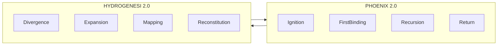

# Triad Architecture Diagrams (Mermaid)

```mermaid
flowchart LR

    subgraph Phoenix["PHOENIX 2.0"]
        P1[Ignition]
        P2[FirstBinding]
        P3[Recursion]
        P4[Return]
    end

    subgraph Hydrogenesi["HYDROGENESI 2.0"]
        H1[Divergence]
        H2[Expansion]
        H3[Mapping]
        H4[Reconstitution]
    end

    Phoenix --> Hydrogenesi
    Hydrogenesi --> Phoenix
```
