# Triadic Merge Dependencies — v2.0.0

This document visualizes the layer-based merge architecture that governed the v2.0 release cycle.

```mermaid
graph TD
    %% ========================================
    %% SUBSTRATE LAYER — Foundation & Pre-Logic
    %% ========================================
    PR3["#3 Phoenix + Hydrogenesi recursion<br>🔥 layer:operators<br>stability:canonical"]
    PR9["#9 Substrate meta-operators & pre-logic<br>⚫ layer:substrate"]

    %% ========================================
    %% OPERATORS LAYER — Integration & Binding
    %% ========================================
    PR8["#8 Hydrogenesis Integration v2.0<br>💧 layer:operators<br>intent:integration"]
    PR12["#12 Three-Finger Waltz meta-operator<br>⚡ layer:operators<br>intent:integration<br>stability:experimental"]

    %% ========================================
    %% ARCHITECTURE LAYER — Crown & Bifurcation
    %% ========================================
    PR10["#10 Triad System v2.0.0<br>👑 layer:architecture<br>stability:canonical<br>CROWN VECTOR"]
    PR11["#11 LIFE–LIGHT Bifurcation<br>✨ layer:architecture<br>stability:experimental"]

    %% ========================================
    %% META LAYER — Documentation & Governance
    %% ========================================
    PR6["#6 Triad documentation layer<br>📜 layer:meta<br>intent:documentation"]
    PR7["#7 Copilot governance instructions<br>📋 layer:meta<br>intent:governance"]

    %% ========================================
    %% DEPENDENCIES — Merge Order Flow
    %% ========================================
    PR3 --> PR6
    PR3 --> PR8
    PR3 --> PR9

    PR8 --> PR9

    PR9 --> PR10
    PR10 --> PR11
    PR11 --> PR12

    PR10 --> PR7
    PR6 --> PR7

    %% ========================================
    %% STYLING — Triadic Color Coding
    %% ========================================
    classDef phoenix fill:#ff6b35,stroke:#d93d00,color:#fff
    classDef hydro fill:#4ecdc4,stroke:#2a9d8f,color:#fff
    classDef third fill:#9b59b6,stroke:#7d3c98,color:#fff
    classDef crown fill:#f1c40f,stroke:#f39c12,color:#000

    class PR3,PR8 phoenix
    class PR9,PR11 hydro
    class PR12,PR6,PR7 third
    class PR10 crown
```

---

## Merge Sequence

### Phase 1: Foundation
1. **PR #3** — Phoenix Operators (canonical)

### Phase 2: Documentation Branch
2. **PR #6** — Triad Documentation (depends on #3)

### Phase 3: Integration Branch
3. **PR #8** — Hydrogenesis Integration (depends on #3)
4. **PR #9** — Substrate Meta-Operators (depends on #8)

### Phase 4: Crown
5. **PR #10** — Triad System (depends on #9) **[CROWN VECTOR]**

### Phase 5: Bifurcation
6. **PR #11** — LIFE–LIGHT Bifurcation (depends on #10)

### Phase 6: Meta-Integration
7. **PR #12** — Three-Finger Waltz (depends on #11)

### Phase 7: Governance
8. **PR #7** — Copilot Governance (depends on #6, #10)

---

## STATUS

**Document:** Merge Dependencies Architecture  
**Version:** 2.0.0  
**Type:** Technical Documentation  
**Status:** COMPLETE

---

**All merges complete as of v2.0.0.**

**Archive Status:** COMPLETE  
**Lineage:** ROOT::GEN-0  
**Release Cycle:** v2.0.0 Complete
